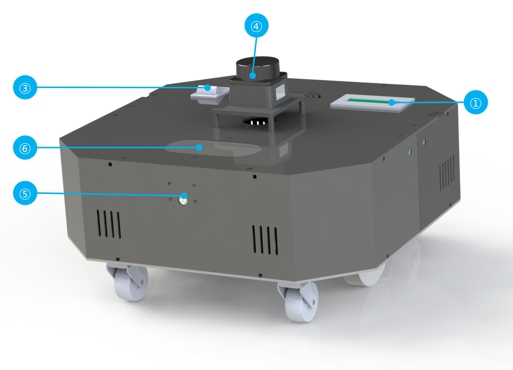
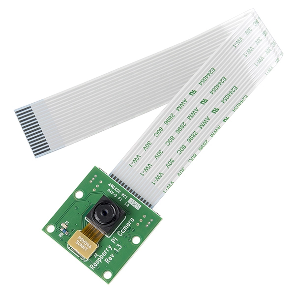
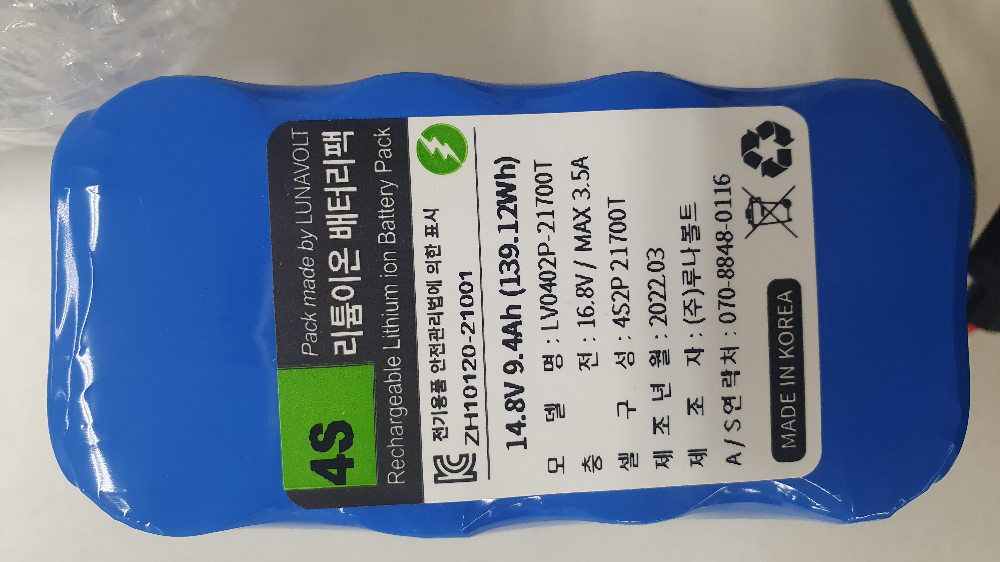

하드웨어 스펙
==================

**목표:** 로봇의 기본 구성 요소를 확인한다.

로봇의 구성요소
---------------------

.. image:: images/zeta2_robot_back_explain.png

① 배터리 표시기 ② 충전 포트 ③ 전원 스위치 ④ LD06 Lidar ⑤ 라즈베리파이 카메라 ⑥ 스피커

주요 부품들
---------------------

로봇의 메인 부품들이다.

.. list-table:: 
   :header-rows: 1

   * - Product Picture
     - Product Description
   * - |part_1| 
     - | Raspberry Pi 4 (8GB)
       | CPU : Quad core Cortex-A72 (ARM v8) 64-bit SoC @ 1.8GHz
       | GPU : Broadcom VideoCore VI
       | Memory : 8GB LPDDR4-3200 SDRAM
       | Storage : Micro SD
   * - |part_2| 
     - | Dimensions: 38*38*34.3mm
       | Detection range: 0.02~12m
       | Angular resolution: 0.2°~1.0°
       | The laser wavelength: 905nm
       | Measurement frequency: 4500Hz
       | Sweep frequency: 5~13Hz
       | Protection grade: IPX-4
       | Measuring Angle: 0°~360°
   * - |part_3| 
     - | Camera Module
       | Resolution : 8mega pixel
       | Sensor : Sony IMX 219 PQ CMOS
   * - |part_4| 
     - | Lithium ion battery pack
       | Charge : 16.8V / 3.5A
       | Output: 14.8V / 9.4Ah (139.12Wh)

블럭 다이어그램
---------------------

로봇의 간단한 다이어그램이다.

요약
-------

로봇의 구성하는 하드웨어와 어떻게 서로 연결되어 있는지 확인해 봤습니다.
