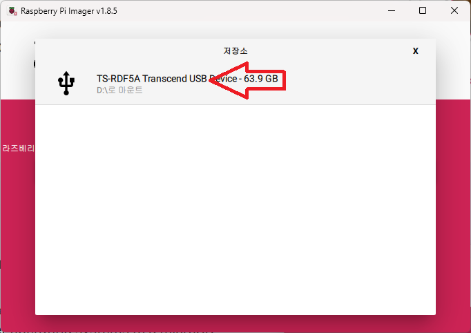
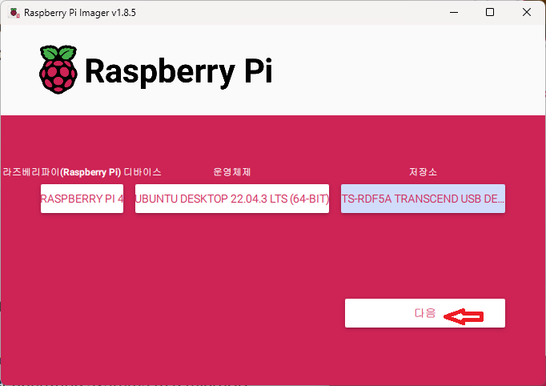
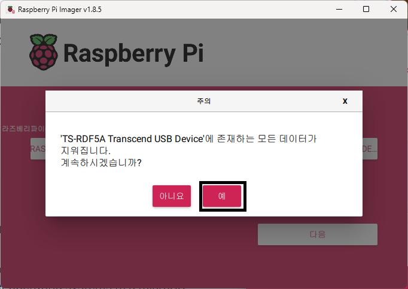

로봇 셋업
==========

**목표:** 로봇에 맞는 OS를 설치한다.

이 과정에서는 로봇에 OS를 설치하는 방법에 대해서 설명합니다.
다른 버전을 설치하여도 상관 없으나 `zeta2_edu_devel <https://github.com/zetabank-devteam/zeta2_edu_devel.git>`__ 과 `zeta2_edu_autonomous <https://github.com/zetabank-devteam/zeta2_edu_autonomous>`__ 을 사용하기 위해선 ubuntu 22.04 를 설치할 것을 권장합니다.

전제조건
--------

1. WiFi가 되는 PC(일반적인 PC는 WiFi를 지원하지 않을 수도 있습니다. 그럴 땐 세팅 작업은 LAN 선으로도 할 수 있습니다. 또한 WiFi 동글을 하나 구해서 WiFi가 되게 하는 것도 하나의 방법입니다.)

2. zeta2 로봇

3. SD 카드를 읽을 수 있는 도구(일반적인 PC에는 SD 카드를 바로 연결할 수 없습니다. 읽을 수 있는 노트북이나 PC라면 없어도 됩니다.)

1 로봇에 우분투 22.04 OS 설치
^^^^^^^^^^^^^^^^^^^^^^^^^^^^^^^^^^^

이 과정은 먼저 PC에서 하는 과정과 로봇에서 하는 과정 2가지로 나뉘어 집니다.

1.1 PC에서
~~~~~~~~~~~

`라즈베리파이 imager <https://www.raspberrypi.com/software/>`__ 를 자신의 PC 환경에 맞게 다운로드 합니다.

.. image:: images/raspberrypi_imager_0.png

첫 화면에선 3개의 선택지가 있을 것입니다.

.. image:: images/raspberrypi_imager_1.png

가장 먼저 장치선택을 클릭하고 다음 나온 화면에서 Raspberry Pi 4 선택합니다.

.. image:: images/raspberrypi_imager_2.png

다시 첫 화면으로 돌아간 다음 운영체제를 선택하고 Other general-purpose OS -> Ubuntu -> 22.04 (64-bit) 순서로 찾아서 선택합니다.

.. image:: images/raspberrypi_imager_4.png

.. image:: images/raspberrypi_imager_5.png

다시 첫 화면으로 돌아와 이번에는 저장소 선택에서 현재 사용하기 위해 연결한 SD 카드를 선택합니다.

다음 -> 예 -> 완료

.. image:: images/raspberrypi_imager_9.png

1.2 로봇에서
~~~~~~~~~~~

OS가 설치된 SD카드를 로봇의 위를 들어 올려서 라즈베리 파이에 장착합니다.

초기 작업에선 로봇을 인터넷에 연결해야 하므로 인터넷선을 연결합니다.

로봇에 키보드와 마우스도 연결해 줍니다. 처음 실행은 `이 가이드 <https://linuxgenie.net/how-to-download-and-install-ubuntu-22-04/>`__ 를 참고합니다. 지역설정은 Seoul, 이름과 비밀번호는 본인이 원하는 것으로 합니다.

이제 로봇에서 우분투를 사용할 준비가 끝났습니다.

2 로봇 ``WiFi`` 설정하기
^^^^^^^^^^^^^^^^^^^^^^^^^^^^^^^^^^^

이번 과정에선 로봇을 무선환경에서 사용할 수 있게 ``WiFi`` 에 연결하는 방법을 알아보겠습니다.

1. 로봇을 화면 오른쪽 위를 클릭하고 wifi 아이콘을 누릅니다

위의 사진은 이미 연결된 상태여서 저렇게 나오긴 합니다.

2. Select Network를 눌러줍니다. 그럼 다음과 같은 화면이 중앙에 나올 것입니다.

3. 본인의 네트워크를 선택하고 Connect 버튼을 누르면 비밀번호 입력하는 화면이 나옵니다.

.. image:: images/robot_wifi_3.png

3. 로봇을 화면 오른쪽 위를 클릭하여 연결된 것을 확인할 수 있습니다.

2 로봇 ``openssh-server`` 설정하기
^^^^^^^^^^^^^^^^^^^^^^^^^^^^^^^^^^^

후에 PC와의 연결을 위해 ``openssh-server`` 를 설치합니다.

.. code-block:: bash
   
   sudo apt update
   sudo apt install openssh-server

또한 로봇의 ``IP`` 를 알아야 ssh에 연결할 수 있습니다.

.. code-block:: bash
   
   sudo apt update
   sudo apt install net-tools

net-tools를 설치하고  ifconfig를 입력하면 아래와 같이 나옵니다.

.. code-block:: bash

   ifconfig

   eth0: flags=4099<UP,BROADCAST,MULTICAST>  mtu 1500
         ether e4:5f:01:f8:f6:61  txqueuelen 1000  (Ethernet)
         RX packets 0  bytes 0 (0.0 B)
         RX errors 0  dropped 0  overruns 0  frame 0
         TX packets 0  bytes 0 (0.0 B)
         TX errors 0  dropped 0 overruns 0  carrier 0  collisions 0

   lo: flags=73<UP,LOOPBACK,RUNNING>  mtu 65536
         inet 127.0.0.1  netmask 255.0.0.0
         inet6 ::1  prefixlen 128  scopeid 0x10<host>
         loop  txqueuelen 1000  (Local Loopback)
         RX packets 269  bytes 24464 (24.4 KB)
         RX errors 0  dropped 0  overruns 0  frame 0
         TX packets 269  bytes 24464 (24.4 KB)
         TX errors 0  dropped 0 overruns 0  carrier 0  collisions 0

   wlan0: flags=4163<UP,BROADCAST,RUNNING,MULTICAST>  mtu 1500
         inet `192.168.0.220`  netmask 255.255.255.0  broadcast 192.168.0.255
         inet6 fe80::97fe:6f81:7ec:6148  prefixlen 64  scopeid 0x20<link>
         ether e4:5f:01:f8:f6:62  txqueuelen 1000  (Ethernet)
         RX packets 13417  bytes 18507752 (18.5 MB)
         RX errors 0  dropped 0  overruns 0  frame 0
         TX packets 3503  bytes 676415 (676.4 KB)
         TX errors 0  dropped 0 overruns 0  carrier 0  collisions 0

`wlan0` 의 `inet` 에 있는 이 주소가 ``IP`` 주소입니다. 즉 ``192.168.0.220`` 라고 확인 할 수 이씁니다.

요약
-------

로봇을 사용하기 위해서 SD 카드에 우분투 OS를 설치하고 로봇의 ``WiFi`` 을 설정하는 작업을 완료했습니다.

또한 나중에 PC와의 연결을 위해 ``openssh-server`` 를 설치하고 로봇의 ``IP`` 를 확인하는 법을 배웠습니다.

다음 단계
----------

다음으론 좀 더 편리한 사용을 위해서 PC에서 로봇에 접속하고 로봇을 사용하는 방법을 학습하겠습니다.