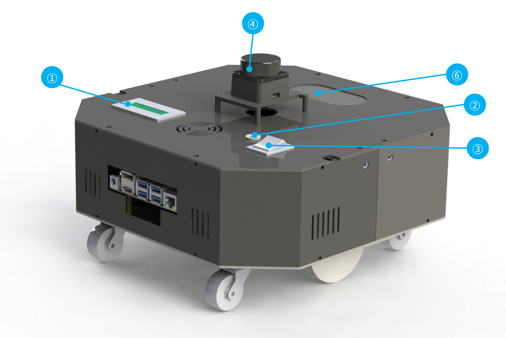
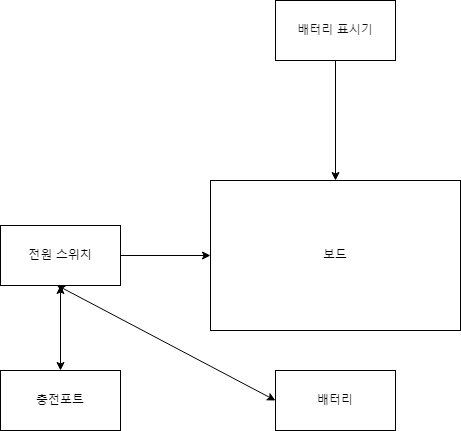
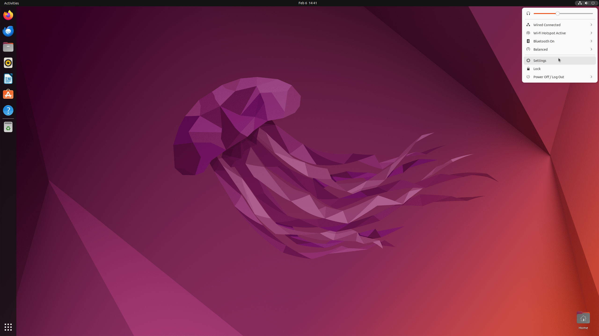
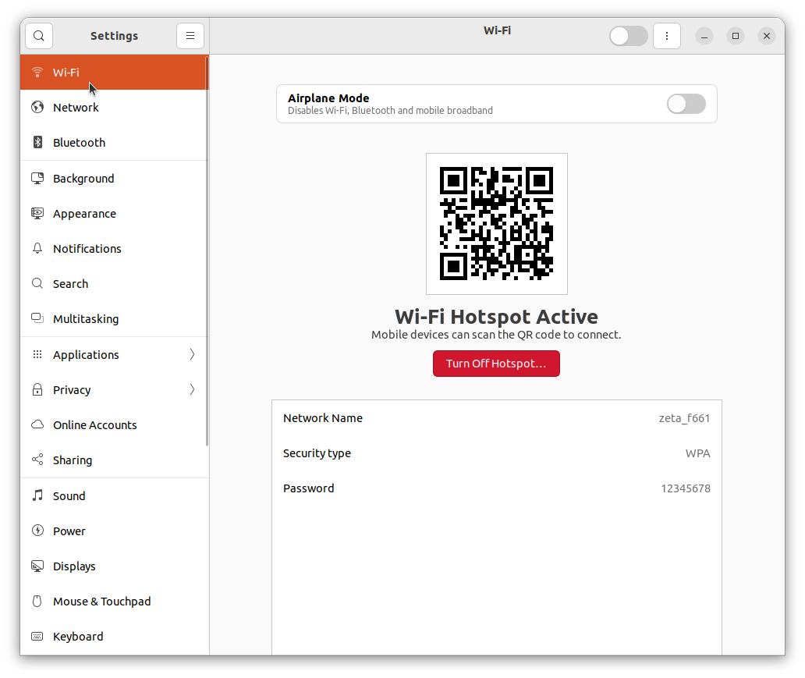
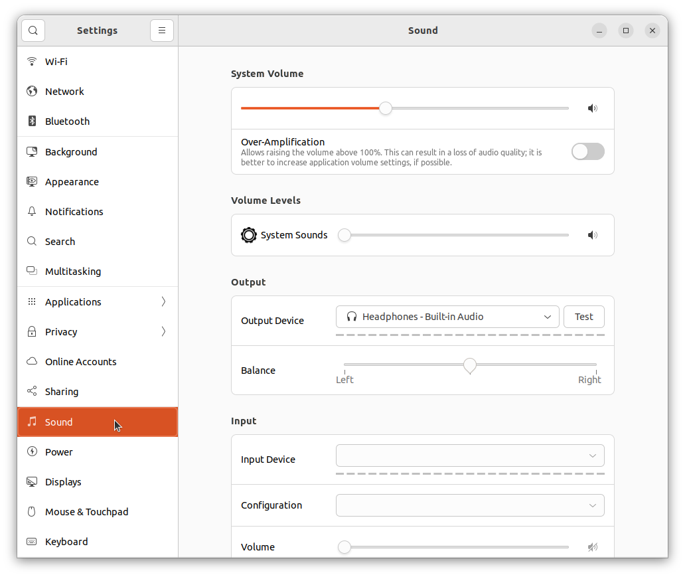
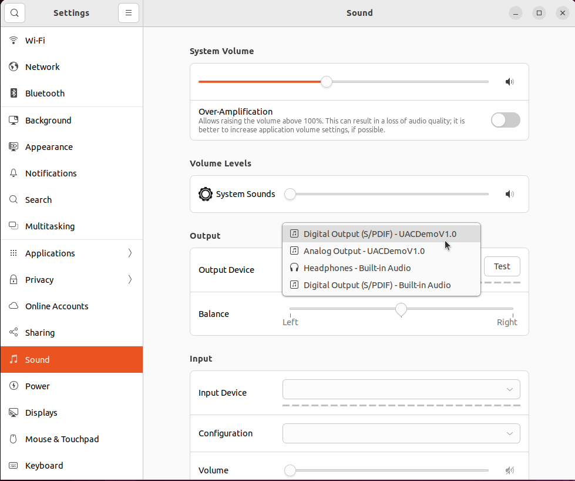
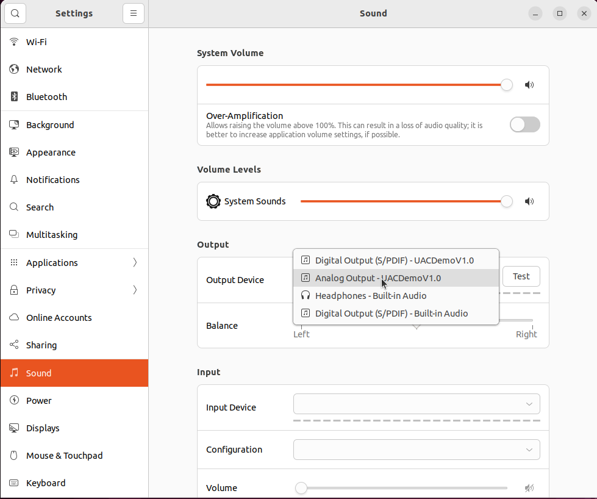
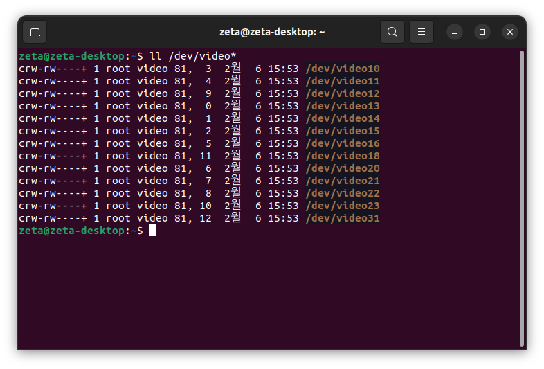
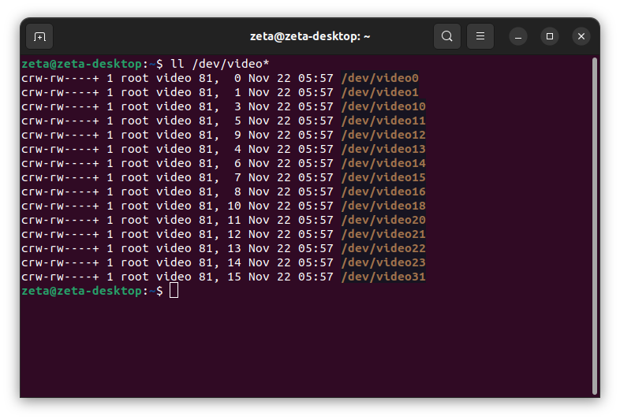
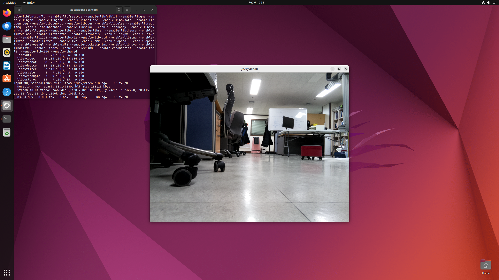

하드웨어 체크
==================

**목표:** 로봇의 하드웨어 상태를 확인하고 해결한다.

이 과정에서는 로봇의 하드웨어 상태를 확인하고 각각의 문제마다 해결할 수 있는 방법에 대해 설명하겠습니다.

전제조건
--------

1. 로봇의 조립완료

2. :doc:`ROS2 </courses/1.install_ros2_humble/3.install_ros2>` 설치 완료

3. :doc:`zeta2_bringup </courses/5.robot_start/1.zeta2_bringup>` 패키지 설치 완료

4. :doc:`로봇 하드웨서 스펙 </courses/0.robot_hardware/1.robot_hardware_spec>` 학습 완료

로봇의 구성요소
---------------------

.. image:: images/zeta2_robot_front_explain.png

앞에서 학습했듯이 로봇엔 ① 배터리 표시기 ② 충전 포트 ③ 전원 스위치 ④ LD06 Lidar ⑤ 라즈베리파이 카메라 ⑥ 스피커 과 같은 다양한 구성 요소들이 있습니다.

하나하나 상태를 확인하고 어떻게 조치 할 수 있는지 알아봅시다.

1 배터리 표시기, 충전포트, 전원스위치
----------------------------------

이 세가지 부품에 문제가 있으면 가장 먼저 의심해볼 수 있는 것은 접선 불량 혹은 단선입니다.

이 부품들은 이렇게 이루어져 있습니다.

모드를 중심으로 배터리 표시기가 연결되어 있고 전원 스위치가 연결되어 있습니다.

전원 스위치에 충전포트가 연결되어 있고 충전포트와 배터리가 같이 연결되어 있습니다.

어느 한 부품의 선이 어딘가에서 끊겼거나 연결이 제대로 되지 않았다면 그 부품은 제대로 작동하지 않을 것 입니다.

선을 새로 납땜을 하거나 그래도 안된다면 부품을 교체해야 합니다.

2 스피커
----------

스피커는 가장 쉽게 테스트 해볼 수 있습니다.

스피커는 로봇의 라즈베리 파이에 연결되어 있습니다.

로봇의 전원이 잘 들어오고 키보드와 마우스 모니터까지 잘 연결이 된다면 테스트 해볼 수 있습니다.

테스트
^^^^^^

먼저 처음 WiFi 세팅할 때 처럼 우측 상단 부분을 클릭합니다.

.. image:: images/speaker_check_1.png

다음으로 ``setting`` 을 클릭합니다.

다음과 같은 화면이 나오고

내려서 Sound를 선택합니다.

Output Device 에서 UACDemoV1.0을 아무거나 선택해줍니다.

볼륨이 작으면 위에 볼륨을 다 올려주면 됩니다.

Test 를 누르고 Left Test와 Right Test를 한 다음

볼륨을 다 올렸는데도 소리가 나오지 않는다면 스피커를 교체해야 합니다.

3 카메라
---------

카메라는 먼저 장치를 인식하는지 확인을 해야 합니다.

.. code-block:: bash
      
  ll /dev/video*

비디오들의 목록을 확인하는 명령어를 처음 입력하면 많은 비디오들이 나올텐데 우리가 원하는 비디오 장치는 0번입니다.

현재 로봇엔 라즈베리파이 카메라가 장착되어 있습니다.

카메라를 인식시키기 위해서는 일단 ``raspi-config`` 를 사용해야 합니다.

라이다 설정할 때 사용했던 도구 입니다.

.. code-block:: bash

    sudo apt install raspi-config
    sudo raspi-config
    Interface Options
    Legacy Camera
    YES Would you like to enable legacy camera support? 

    "The serial login shell is enabled, The serial interface is enabled"

리부팅 후

이를 비디오 장치로 인식 시키기 위해서는 ``v4l-utils`` 가 필요합니다.

설치 방법은 아래와 같습니다.

.. code-block:: bash

  sudo apt update
  sudo apt install v4l-utils

장치가 인식 된다면 아래와 같이 나올 것입니다.

.. code-block:: bash
      
  ll /dev/video*

카메라 출력을 보고 싶으면 출력을 도와주는 패키지를 설치해야 합니다. 여기선 ``ffmpeg`` 를 사용하겠습니다.

.. code-block:: bash

  sudo apt update
  sudo apt install ffmpeg

아래의 명령어를 입력하여 재생새켜 줍니다.

.. code-block:: bash

  ffplay /dev/video0

만약 카메라가 안나온다면 위의 ``raspi-config`` 설정을 다시 해보세요.

장치가 전혀 인식되지 않는다면 카메라의 고장이니 카메라를 교체해야 합니다.

4 라이다
---------

라이다는 :doc:`zeta2_bringup </courses/5.robot_start/1.zeta2_bringup>` 을 했다면 잘 나오는걸 알 수 있을 것이다.

그래도 일단 확인을 하는 방법은 

:doc:`zeta2_bringup </courses/5.robot_start/1.zeta2_bringup>` 을 설치하고 ``zeta2_bringup.launch.py`` 를 실행하는 대신에

.. code-block:: bash

  ros2 launch ldlidar ldlidar.launch.py serial_port:=/dev/ttyS0

라이다 패키지만 따로 실행을 해보는 것이다.

그리고 ``/scan`` 데이터가 잘 올라오는지 확인하면 된다.

.. code-block:: bash

  ros2 topic hz /scan

  average rate: 10.001
          min: 0.100s max: 0.100s std dev: 0.00016s window: 12
  average rate: 10.001
          min: 0.100s max: 0.100s std dev: 0.00012s window: 22
  average rate: 10.001
          min: 0.100s max: 0.100s std dev: 0.00013s window: 33

10hz의 속도로 잘 나오는 것을 확인할 수 있다.

데이터를 보고 싶다면

.. code-block:: bash

  ros2 topic echo /scan

  header:
    stamp:
      sec: 1707205361
      nanosec: 897271814
    frame_id: base_scan
  angle_min: 0.0
  angle_max: 6.2831854820251465
  angle_increment: 0.01392383687198162
  time_increment: 0.0
  scan_time: 0.0
  range_min: 0.004999999888241291
  range_max: 15.0
  ranges:
  - 9.35200023651123
  - 9.880000114440918
  - 9.848999977111816
  - 9.833000183105469
  - 9.848999977111816
  - 9.833000183105469
  - 9.833000183105469
  - .inf
  - .inf
  - .inf
  - .inf
  '
  '
  '
  '

이런 식으로 ``/scan`` 데이터가 올라오는 것을 확인 할 수 있다.

만약 ``ll /dev/ttyS0`` 이 없다면 :doc:`zeta2_bringup </courses/5.robot_start/1.zeta2_bringup>` 의 라이다 과정을 다시해보고

그래도 나타나지 않는다면 연결 확인을 다시 한다.

그럼에도 나타나지 않는다면 교체해야 한다.

5 모터 혹은 IMU
----------------

이 두 가지가 안되는 경우가 조금 큰 문제이다. 

가장 먼저 할 수 있는건 권한을 줘보는 것이다.

.. code-block:: bash
  
  ll /dev/ttyUSB*
  sudo chmod 777 /dev/ttyUSB*

권한을 줬는데도 해결되지 않는다면 일단 로봇을 재부팅 해본다.

그럼에도 해결되지 않는다면 로봇을 본사로 가지고 가서 확인을 해봐야 할 것이다.

요약
-------

로봇의 구성하는 하드웨어 장치들을 확인하고 문제가 생겼을 경우 어떻게 해결할 수 있을지에 대해서 배웠습니다.