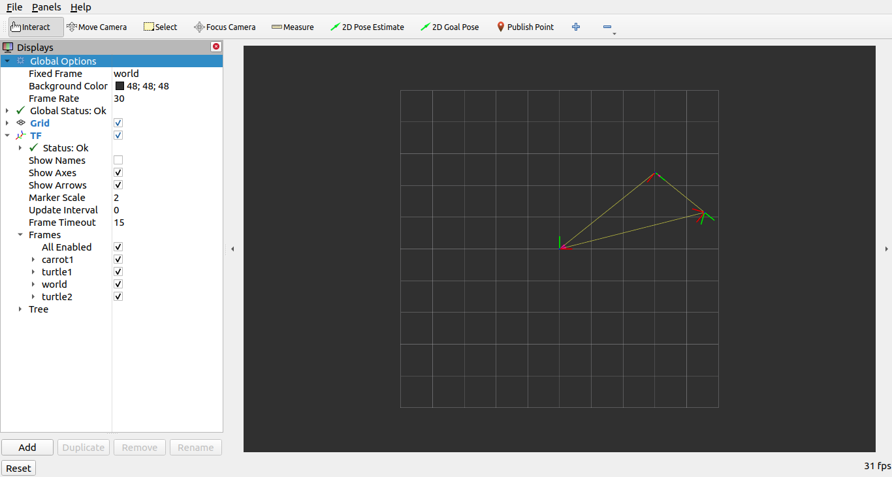

.. redirect-from::

    Tutorials/Launch-Files/Using-ROS2-Launch-for-Large-Projects
    Tutorials/Launch/Using-ROS2-Launch-for-Large-Projects

.. _UsingROS2LaunchForLargeProjects:

대규모 프로젝트 관리
=======================

**목표:** ROS 2 런치 파일을 사용하여 대규모 프로젝트를 관리하는 데 사용되는 모범 사례를 학습합니다.

**튜토리얼 레벨:** 중급

**소요 시간:** 20분

.. contents:: 목차
   :depth: 3
   :local:

배경
----

이 튜토리얼에서는 대규모 프로젝트를 관리하는 데 도움이 되는 몇 가지 유용한 팁과 ROS 2 런치 파일을 사용하는 방법에 대해 설명합니다.
주요 초점은 런치 파일을 어떻게 구조화하여 가능한 한 다양한 상황에서 재사용할 수 있도록 하는 것입니다.
또한 매개변수, YAML 파일, 리매핑, 네임스페이스, 기본 인수 및 RViz 구성과 같은 다양한 ROS 2 런치 도구의 사용 예제를 다룹니다.

전제 조건
----------

이 튜토리얼에서는 :doc:`turtlesim </courses/2.tutorial_cli_ros2/2.turtlesim_rqt>` 및 :doc:`turtle_tf2_py <../6.tf2/0.index>` 패키지를 사용합니다.
또한 ``ament_python`` 빌드 유형의 ``launch_tutorial`` 이라는 새로운 패키지를 :doc:`만들었다고 가정합니다 </courses/3.tutorial_client_libraries/3.create_package>`.

소개
----

로봇에서의 대규모 응용 프로그램은 일반적으로 여러 연결된 노드로 구성되며 각 노드에는 많은 매개변수가 있을 수 있습니다.
거북 시뮬레이터의 여러 거북을 시뮬레이션하는 것이 좋은 예입니다.
거북 시뮬레이션에는 여러 거북 노드, 월드 구성 및 TF 브로드캐스터 및 리스너 노드가 포함됩니다.
모든 노드 사이에는 이러한 노드의 동작 및 외관에 영향을 주는 많은 ROS 매개변수가 있습니다.
ROS 2 런치 파일을 사용하면 모든 노드를 시작하고 노드로 매개변수를 설정할 수 있는 한 곳에서 시작할 수 있습니다.
튜토리얼의 끝에는 ``launch_turtlesim.launch.py`` 런치 파일을 ``launch_tutorial`` 패키지의 ``launch`` 폴더에 빌드합니다.
이 런치 파일은 두 개의 거북 시뮬레이션을 시뮬레이션하는 다양한 노드를 시작하고 TF 브로드캐스터 및 리스너를 시작하며 매개변수를 로드하고 RViz 구성을 시작합니다.
이 튜토리얼에서는 이 런치 파일과 관련된 모든 기능을 살펴보겠습니다.

런치 파일 작성
--------------------

1 최상위 구성
^^^^^^^^^^^^^^^^^^^^^^^^

런치 파일을 작성하는 과정에서의 주요 목표 중 하나는 가능한 한 재사용 가능하도록 만드는 것입니다.
이는 관련된 노드 및 구성을 별도의 런치 파일로 묶어서 수행할 수 있습니다.
그런 다음 특정 구성에 대한 최상위 런치 파일을 작성할 수 있습니다.
이렇게 하면 동일한 로봇 간의 이동을 런치 파일을 전혀 변경하지 않고 수행할 수 있습니다.
실제 로봇에서 시뮬레이션으로 이동하는 것과 같은 변경도 몇 가지 변경만으로 수행할 수 있습니다.

이제 이것이 가능하게 만드는 최상위 런치 파일 구조를 살펴보겠습니다.
먼저 별도의 런치 파일을 호출하는 런치 파일을 만들어 보겠습니다.
이를 위해 ``launch_tutorial`` 패키지의 ``/launch`` 폴더에 ``launch_turtlesim.launch.py`` 파일을 생성합니다.

.. code-block:: python

   import os

   from ament_index_python.packages import get_package_share_directory

   from launch import LaunchDescription
   from launch.actions import IncludeLaunchDescription
   from launch.launch_description_sources import PythonLaunchDescriptionSource

   def generate_launch_description():
      turtlesim_world_1 = IncludeLaunchDescription(
         PythonLaunchDescriptionSource([os.path.join(
            get_package_share_directory('launch_tutorial'), 'launch'),
            '/turtlesim_world_1.launch.py'])
         )
      turtlesim_world_2 = IncludeLaunchDescription(
         PythonLaunchDescriptionSource([os.path.join(
            get_package_share_directory('launch_tutorial'), 'launch'),
            '/turtlesim_world_2.launch.py'])
         )
      broadcaster_listener_nodes = IncludeLaunchDescription(
         PythonLaunchDescriptionSource([os.path.join(
            get_package_share_directory('launch_tutorial'), 'launch'),
            '/broadcaster_listener.launch.py']),
         launch_arguments={'target_frame': 'carrot1'}.items(),
         )
      mimic_node = IncludeLaunchDescription(
         PythonLaunchDescriptionSource([os.path.join(
            get_package_share_directory('launch_tutorial'), 'launch'),
            '/mimic.launch.py'])
         )
      fixed_frame_node = IncludeLaunchDescription(
         PythonLaunchDescriptionSource([os.path.join(
            get_package_share_directory('launch_tutorial'), 'launch'),
            '/fixed_frame_broadcaster.launch.py'])
         )
      rviz_node = IncludeLaunchDescription(
         PythonLaunchDescriptionSource([os.path.join(
            get_package_share_directory('launch_tutorial'), 'launch'),
            '/turtlesim_rviz.launch.py'])
         )

      return LaunchDescription([
         turtlesim_world_1,
         turtlesim_world_2,
         broadcaster_listener_nodes,
         mimic_node,
         fixed_frame_node,
         rviz_node
      ])

이 런치 파일은 다른 런치 파일 세트를 포함합니다.
각 포함된 런치 파일은 노드, 매개변수 및 필요한 경우 중첩된 포함을 포함하는 것과 관련된 하나의 시스템 부분과 관련됩니다.
구체적으로 두 개의 거북 시뮬레이션 월드, TF 브로드캐스터, TF 리스너, 미미크 및 고정 프레임 브로드캐스터 및 RViz 노드를 시작합니다.

.. note:: 설계 팁: 최상위 런치 파일은 짧아야하며, 응용 프로그램의 하위 구성요소에 해당하는 다른 파일을 포함하고 일반적으로 변경되는 매개변수에 포함되어야 합니다.

나중에 보게 되겠지만 다음과 같은 방법으로 런치 파일을 작성하면 시스템의 하나를 쉽게 바꿀 수 있습니다. 하지만 성능과 사용상의 이유로 일부 노드나 런치 파일을 따로 런치해야 하는 경우도 있습니다.

.. note:: 디자인 팁: 응용 프로그램이 얼마나 많은 최상위 런치 파일이 필요한지 결정할 때 어떤 트레이드오프가 있는지 고려하십시오.

2 매개변수
^^^^^^^^^^^^

2.1 런치 파일에서 매개변수 설정
~~~~~~~~~~~~~~~~~~~~~~~~~~~~~~~~~~~~~~~~~

첫 번째 터틀심 시뮬레이션을 시작하는 런치 파일을 작성하여 시작하겠습니다. 먼저 ``turtlesim_world_1.launch.py`` 라는 새 파일을 만듭니다.

.. code-block:: python

   from launch import LaunchDescription
   from launch.actions import DeclareLaunchArgument
   from launch.substitutions import LaunchConfiguration, TextSubstitution

   from launch_ros.actions import Node

   def generate_launch_description():
      background_r_launch_arg = DeclareLaunchArgument(
         'background_r', default_value=TextSubstitution(text='0')
      )
      background_g_launch_arg = DeclareLaunchArgument(
         'background_g', default_value=TextSubstitution(text='84')
      )
      background_b_launch_arg = DeclareLaunchArgument(
         'background_b', default_value=TextSubstitution(text='122')
      )

      return LaunchDescription([
         background_r_launch_arg,
         background_g_launch_arg,
         background_b_launch_arg,
         Node(
            package='turtlesim',
            executable='turtlesim_node',
            name='sim',
            parameters=[{
               'background_r': LaunchConfiguration('background_r'),
               'background_g': LaunchConfiguration('background_g'),
               'background_b': LaunchConfiguration('background_b'),
            }]
         ),
      ])

이 런치 파일은 터틀심 노드인 ``turtlesim_node`` 를 시작하며, 노드에 정의된 시뮬레이션 구성 매개변수를 정의하고 전달합니다.

2.2 YAML 파일에서 매개변수 로딩
~~~~~~~~~~~~~~~~~~~~~~~~~~~~~~~~~~~~~

두 번째 런치에서는 다른 구성으로 두 번째 터틀심 시뮬레이션을 시작합니다. 이제 ``turtlesim_world_2.launch.py`` 파일을 만듭니다.

.. code-block:: python

   import os

   from ament_index_python.packages import get_package_share_directory

   from launch import LaunchDescription
   from launch_ros.actions import Node

   def generate_launch_description():
      config = os.path.join(
         get_package_share_directory('launch_tutorial'),
         'config',
         'turtlesim.yaml'
         )

      return LaunchDescription([
         Node(
            package='turtlesim',
            executable='turtlesim_node',
            namespace='turtlesim2',
            name='sim',
            parameters=[config]
         )
      ])

이 런치 파일은 YAML 구성 파일에서 직접로드하는 매개변수 값을 사용하여 동일한 ``turtlesim_node`` 를 시작합니다.
YAML 파일에 인수 및 매개변수를 정의하면 많은 변수를 저장하고 로드하기가 쉬워집니다.
또한 현재 ``ros2 param`` 목록에서 YAML 파일을 쉽게 내보낼 수 있습니다.
자세한 내용은 :doc:`매개변수 이해 </courses/2.tutorial_cli_ros2/6.parameters>` 튜토리얼을 참조하십시오.

이제 패키지의 ``/config`` 폴더에 ``turtlesim.yaml`` 라는 구성 파일을 만들어 런치 파일에서 로드하도록합니다.

.. code-block:: YAML

   /turtlesim2/sim:
      ros__parameters:
         background_b: 255
         background_g: 86
         background_r: 150

이제 ``turtlesim_world_2.launch.py`` 런치 파일을 시작하면 미리 구성된 배경 색상을 사용하여 ``turtlesim_node`` 을 시작합니다.

매개변수 사용 및 YAML 파일 사용에 대한 자세한 내용은 :doc:`매개변수 이해 </courses/2.tutorial_cli_ros2/6.parameters>` 튜토리얼을 참조하십시오.

2.3 YAML 파일에서 와일드카드 사용
~~~~~~~~~~~~~~~~~~~~~~~~~~~~~~~~~

같은 매개변수를 여러 노드에서 설정하려는 경우가 있습니다.
이러한 노드는 다른 네임스페이스 또는 이름을 가질 수 있지만 여전히 동일한 매개변수를 가질 수 있습니다.
네임스페이스와 노드 이름을 명시적으로 정의하는 별도의 YAML 파일을 정의하는 것은 효율적이지 않습니다.
와일드카드 문자를 사용하여 텍스트 값에서 알 수 없는 문자에 대한 대체 역할을 하는 솔루션을 사용하실 수 있습니다.
와일드카드 구문을 사용하여 여러 다른 노드에 매개변수를 적용할 수 있습니다.

이제 ``turtlesim_world_3.launch.py`` 와 비슷한 새로운 런치 파일을 만들어 하나의 ``turtlesim_node`` 노드를 더 추가하겠습니다.

.. code-block:: python

   ...
   Node(
      package='turtlesim',
      executable='turtlesim_node',
      namespace='turtlesim3',
      name='sim',
      parameters=[config]
   )

그러나 동일한 YAML 파일을로드하더라도 세 번째 터틀심 월드의 모양에는 영향을주지 않습니다. 그 이유는 해당 매개변수가 다음과 같이 다른 네임스페이스에 저장되어 있기 때문입니다.

.. code-block:: console

   /turtlesim3/sim:
      background_b
      background_g
      background_r

따라서 동일한 매개변수를 사용하는 동일한 노드에 대한 새로운 구성을 만드는 대신 와일드카드 구문을 사용할 수 있습니다. ``/**`` 는 노드 이름과 네임스페이스의 차이에 관계없이 모든 노드에서 모든 매개변수를 할당합니다.

이제 ``turtlesim.yaml`` 파일을 다음과 같이 업데이트하겠습니다. 패키지의 ``/config`` 폴더에 있습니다.

.. code-block:: YAML

   /**:
      ros__parameters:
         background_b: 255
         background_g: 86
         background_r: 150

이제 메인 런치 파일에 ``turtlesim_world_3.launch.py`` 런치 설명을 포함시킵니다.
이러한 런치 설명에서 해당 구성 파일을 사용하면 ``turtlesim3/sim`` 및 ``turtlesim2/sim`` 노드에서 지정된 값에 대한 ``background_b``, ``background_g`` 및 ``background_r`` 매개변수가 할당됩니다.

3 네임스페이스
^^^^^^^^^^^^

아마도 이미 눈치챘겠지만, ``turtlesim_world_2.launch.py`` 파일에서 터틀심 월드의 네임스페이스를 정의했습니다.
고유한 네임스페이스를 사용하면 노드 이름 또는 토픽 이름 충돌없이 두 개의 유사한 노드를 시작할 수 있습니다.

.. code-block:: python

   namespace='turtlesim2',

그러나 런치 파일에 많은 수의 노드가 포함되어 있는 경우 각각에 대한 네임스페이스를 정의하는 것은 번거로울 수 있습니다.
이 문제를 해결하려면 ``PushRosNamespace`` 액션을 사용하여 각 런치 파일 설명에 대한 전역 네임스페이스를 정의할 수 있습니다.
모든 중첩된 노드는 자동으로 해당 네임스페이스를 상속받게 됩니다.

이를 위해 먼저 ``turtlesim_world_2.launch.py`` 파일에서 ``namespace='turtlesim2'`` 줄을 제거해야 합니다. 그런 다음 ``launch_turtlesim.launch.py`` 파일을 다음과 같이 업데이트해야 합니다.

.. code-block:: python

   from launch.actions import GroupAction
   from launch_ros.actions import PushRosNamespace

      ...
      turtlesim_world_2 = IncludeLaunchDescription(
         PythonLaunchDescriptionSource([os.path.join(
            get_package_share_directory('launch_tutorial'), 'launch'),
            '/turtlesim_world_2.launch.py'])
         )
      turtlesim_world_2_with_namespace = GroupAction(
        actions=[
            PushRosNamespace('turtlesim2'),
            turtlesim_world_2,
         ]
      )

마지막으로 ``return LaunchDescription`` 문에서 ``turtlesim_world_2`` 대신 ``turtlesim_world_2_with_namespace`` 을 사용하도록 변경합니다.
결과적으로 ``turtlesim_world_2.launch.py`` 런치 설명의 각 노드는 ``turtlesim2`` 네임스페이스를 가지게 됩니다.

4 노드 재사용
^^^^^^^^^^^^^^^

이제 ``broadcaster_listener.launch.py`` 라는 파일을 만들겠습니다.

.. code-block:: python

   from launch import LaunchDescription
   from launch.actions import DeclareLaunchArgument
   from launch.substitutions import LaunchConfiguration

   from launch_ros.actions import Node

   def generate_launch_description():
      return LaunchDescription([
         DeclareLaunchArgument(
            'target_frame', default_value='turtle1',
            description='대상 프레임 이름.'
         ),
         Node(
            package='turtle_tf2_py',
            executable='turtle_tf2_broadcaster',
            name='broadcaster1',
            parameters=[
               {'turtlename': 'turtle1'}
            ]
         ),
         Node(
            package='turtle_tf2_py',
            executable='turtle_tf2_broadcaster',
            name='broadcaster2',
            parameters=[
               {'turtlename': 'turtle2'}
            ]
         ),
         Node(
            package='turtle_tf2_py',
            executable='turtle_tf2_listener',
            name='listener',
            parameters=[
               {'target_frame': LaunchConfiguration('target_frame')}
            ]
         ),
      ])

이 파일에서는 ``target_frame`` 런치 인수를 선언하고 기본값으로 ``turtle1`` 을 사용했습니다.
기본값은 런치 파일이 노드에 전달할 인수를 받거나, 인수가 제공되지 않은 경우 노드에 기본값을 전달합니다.

그런 다음 서로 다른 이름과 매개변수를 사용하여 ``turtle_tf2_broadcaster`` 노드를 두 번 시작합니다. 이렇게 하면 충돌없이 동일한 노드를 복제할 수 있습니다.

또한 ``turtle_tf2_listener`` 노드를 시작하고 위에서 선언하고 얻은 ``target_frame`` 매개변수를 설정합니다.

5 매개변수 오버라이드
^^^^^^^^^^^^^^^^^^^^^

``broadcaster_listener.launch.py`` 파일을 최상위 런치 파일에서 호출한 것을 기억하십시오. 이것 외에도 런치 파일에 ``target_frame`` 런치 인수를 전달했습니다.

.. code-block:: python

   broadcaster_listener_nodes = IncludeLaunchDescription(
      PythonLaunchDescriptionSource([os.path.join(
         get_package_share_directory('launch_tutorial'), 'launch'),
         '/broadcaster_listener.launch.py']),
      launch_arguments={'target_frame': 'carrot1'}.items(),
      )

이 구문을 사용하면 기본 목표 대상 프레임을 ``carrot1`` 로 변경할 수 있습니다.
``turtle2`` 가 ``carrot1`` 대신 ``turtle1`` 을 따르도록 하려면 ``launch_arguments`` 를 정의한 줄을 제거하십시오. 이렇게하면 ``target_frame`` 이 기본값인 ``turtle1`` 을 할당합니다.

6 리매핑
^^^^^^^^^^^

이제 ``mimic.launch.py`` 라는 파일을 만들겠습니다.

.. code-block:: python

   from launch import LaunchDescription
   from launch_ros.actions import Node

   def generate_launch_description():
      return LaunchDescription([
         Node(
            package='turtlesim',
            executable='mimic',
            name='mimic',
            remappings=[
               ('/input/pose', '/turtle2/pose'),
               ('/output/cmd_vel', '/turtlesim2/turtle1/cmd_vel'),
            ]
         )
      ])

이 런치 파일은 ``mimic`` 노드를 시작하며, 이 노드는 다른 터틀심을 따르도록 명령을 제공합니다.
이 노드는 ``/input/pose`` 토픽에서 대상 포즈를 받도록 설계되었습니다.
이 경우 대상 포즈를 ``/turtle2/pose`` 토픽에서 다시 지정하려고 합니다.
마지막으로 ``/output/cmd_vel`` 토픽을 ``/turtlesim2/turtle1/cmd_vel`` 로 다시 지정합니다.
이렇게 하면 ``turtlesim2`` 시뮬레이션 월드의 ``turtlesim3/sim`` 이 초기 터틀심 월드의 ``turtle2`` 를 따르게 됩니다.

7 구성 파일
^^^^^^^^^^^^^^

이제 ``turtlesim_rviz.launch.py`` 라는 파일을 만들겠습니다.

.. code-block:: python

   import os

   from ament_index_python.packages import get_package_share_directory

   from launch import LaunchDescription
   from launch_ros.actions import Node

   def generate_launch_description():
      rviz_config = os.path.join(
         get_package_share_directory('turtle_tf2_py'),
         'rviz',
         'turtle_rviz.rviz'
         )

      return LaunchDescription([
         Node(
            package='rviz2',
            executable='rviz2',
            name='rviz2',
            arguments=['-d', rviz_config]
         )
      ])

이 런치 파일은 ``turtle_tf2_py`` 패키지에 정의된 구성 파일을 사용하여 RViz를 시작합니다.
이 RViz 구성은 월드 프레임을 설정하고 TF 시각화를 활성화하며 RViz를 위에서 아래로 볼 수 있도록 시작합니다.

8 환경 변수
^^^^^^^^^^^^^^^^^^^^^^^

마지막으로 패키지 내에서 ``fixed_broadcaster.launch.py`` 라는 런치 파일을 만듭니다.

.. code-block:: python

   from launch import LaunchDescription
   from launch.actions import DeclareLaunchArgument
   from launch.substitutions import EnvironmentVariable, LaunchConfiguration
   from launch_ros.actions import Node

   def generate_launch_description():
      return LaunchDescription([
         DeclareLaunchArgument(
               'node_prefix',
               default_value=[EnvironmentVariable('USER'), '_'],
               description='prefix for node name'
         ),
         Node(
               package='turtle_tf2_py',
               executable='fixed_frame_tf2_broadcaster',
               name=[LaunchConfiguration('node_prefix'), 'fixed_broadcaster'],
         ),
      ])

이 런치 파일은 런치 파일 내에서 환경 변수를 호출하는 방법을 보여줍니다.
환경 변수를 사용하여 서로 다른 컴퓨터 또는 로봇의 노드를 구별하기 위한 이름 공간을 정의하거나 푸시할 수 있습니다

런치 파일 실행
--------------------

1. ``setup.py`` 업데이트
^^^^^^^^^^^^^^^^^

``setup.py`` 를 열고 런치 파일을 ``launch/`` 폴더에서 설치하고 구성 파일을 ``config/`` 에서 설치하도록 다음과 같이 추가합니다.
``data_files`` 필드는 다음과 같아야 합니다.

.. code-block:: python

   import os
   from glob import glob
   from setuptools import setup
   ...

   data_files=[
         ...
         (os.path.join('share', package_name, 'launch'),
            glob(os.path.join('launch', '*.launch.py'))),
         (os.path.join('share', package_name, 'config'),
            glob(os.path.join('config', '*.yaml'))),
      ],

2. 빌드 및 실행
^^^^^^^^^^^^^^^

이제 패키지를 빌드하고 다음 명령을 사용하여 최상위 런치 파일을 실행하면 결과를 볼 수 있습니다.

.. code-block:: console

   ros2 launch launch_tutorial launch_turtlesim.launch.py

이제 두 개의 터틀심 시뮬레이션이 시작됩니다. 첫 번째 시뮬레이션에는 두 마리의 터틀이 있으며 두 번째 시뮬레이션에는 하나의 터틀이 있습니다.
첫 번째 시뮬레이션에서는 ``turtle2`` 가 월드의 왼쪽 아래에 스폰됩니다. 그 목표는 ``turtle1`` 프레임과 x-축을 따라 다섯 미터 떨어진 ``carrot1`` 프레임에 도달하는 것입니다.

두 번째 시뮬레이션의 ``turtlesim2/turtle1`` 은 ``turtle2`` 의 동작을 모방하도록 설계되었습니다.

``turtle1`` 을 제어하려면 텔레옵 노드를 실행하십시오.

.. code-block:: console

   ros2 run turtlesim turtle_teleop_key

결과적으로 비슷한 이미지를 볼 수 있습니다:

.. image:: images/turtlesim_worlds.png

또한 RViz도 시작됩니다. 이 RViz는 모든 터틀 프레임을 ``world`` 프레임에 대해 표시합니다. 이 월드의 원점은 왼쪽 아래 모퉁이에 있습니다.

요약
-------

이 튜토리얼에서는 ROS 2 런치 파일을 사용하여 대규모 프로젝트를 조직하는 방법을 배웠습니다.
다양한 런치 파일을 작성하고 재사용할 수 있도록 구성했습니다. 또한 매개변수, 네임스페이스, 노드 재사용, 매개변수 오버라이드, 리매핑, 구성 파일 및 환경 변수를 활용하여 런치 파일을 보다 유연하게 만드는 방법을 살펴보았습니다.
이러한 도구와 개념을 활용하여 복잡한 로봇 소프트웨어 시스템을 효율적으로 관리할 수 있습니다.
