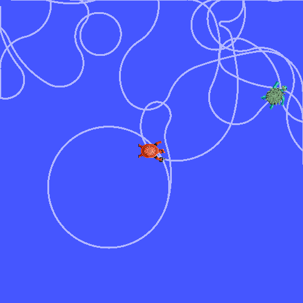
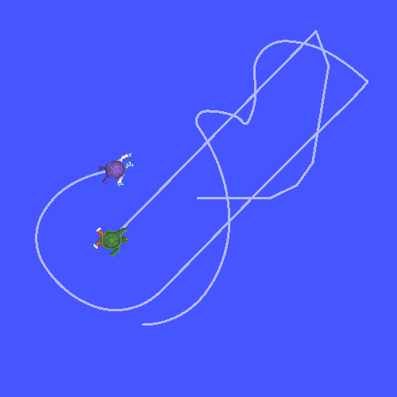

시간을 여행하다 (Python)
============================

**목표:** tf2의 고급 시간 여행 기능에 대해 알아보세요.

배경 정보
----------

이전 튜토리얼에서는 :doc:`tf2와 시간의 기초 <./10.learning_about_tf2_and_time_py>` 에 대해 논의했습니다.
이 튜토리얼에서는 한 걸음 더 나아가서 강력한 tf2 트릭을 소개합니다: 시간 여행.
간단히 말해, tf2 라이브러리의 주요 기능 중 하나는 공간뿐만 아니라 시간에 따라 데이터를 변환할 수 있다는 것입니다.

이 tf2 시간 여행 기능은 로봇의 자세를 장기간 모니터링하거나, 리더의 "걸음"을 따르는 추종 로봇을 구축하는 것과 같은 다양한 작업에 유용할 수 있습니다.
이 시간 여행 기능을 사용하여 시간을 되돌아가 변환을 찾아보고 ``turtle2`` 가 ``carrot1`` 의 5초 뒤를 따라가도록 프로그래밍합니다.

시간 여행
-----------

먼저, 이전 튜토리얼 :doc:`시간 사용하기 <./10.learning_about_tf2_and_time_py>` 에서 끝난 곳으로 돌아갑시다.
``learning_tf2_py`` 패키지로 이동합니다.

이제, 두 번째 거북이를 현재 carrot의 위치로 이동시키는 대신, 두 번째 거북이를 첫 번째 당근이 5초 전에 있었던 곳으로 이동시킵니다.
``turtle_tf2_listener.py`` 파일에서 ``lookup_transform()`` 호출을 편집하여 다음과 같이 변경하세요.

.. code-block:: python

    when = self.get_clock().now() - rclpy.time.Duration(seconds=5.0)
    trans = self.tf_buffer.lookup_transform(
        to_frame_rel,
        from_frame_rel,
        when,
        timeout=rclpy.duration.Duration(seconds=0.05))

이제 이를 실행하면 처음 5초 동안 두 번째 거북이는 어디로 가야 할지 알지 못하며, 왜냐하면 당근의 5초 동안의 자세 기록이 아직 없기 때문입니다.
그러나 이후 5초 동안 어떤 일이 벌어질까요? 한 번 시도해 봅시다.

.. code-block:: console

    ros2 launch learning_tf2_py turtle_tf2_fixed_frame_demo.launch.py

이제 화면 샷과 같이 거북이가 제어를 받지 않고 무작위로 움직이는 것을 알 수 있어야 합니다. 이러한 동작의 이유를 이해하려고 노력해 보겠습니다.

#. 우리의 코드에서 tf2에게 다음과 같은 질문을 했습니다: "5초 전에 ``turtle2`` 상대적으로 ``carrot1`` 의 자세는 어떻게 되었나요?". 이것은 두 번째 거북이가 5초 전에 어디에 있었는지, 그리고 첫 번째 당근이 5초 전에 어디에 있었는지를 기반으로 제어한다는 것을 의미합니다.

#. 그러나 우리가 실제로 물어보고 싶은 것은 다음과 같습니다: "5초 전에 ``carrot1`` 의 자세는 현재 ``turtle2`` 의 위치를 기준으로 어떻게 되었나요?".

lookup_transform()에 대한 고급 API
-----------------------------------

tf2에게 이러한 구체적인 질문을 하려면 추가 매개 변수로 ``lookup_transform_full()`` 메서드를 호출하여 명시적으로 언제 지정된 변환을 획득할지 지정해야 합니다.
이 작업은 추가 매개 변수를 사용하여 수행됩니다.
이제 코드는 다음과 같이 보일 것입니다.

.. code-block:: python

    when = self.get_clock().now() - rclpy.time.Duration(seconds=5.0)
    trans = self.tf_buffer.lookup_transform_full(
            target_frame=to_frame_rel,
            target_time=rclpy.time.Time(),
            source_frame=from_frame_rel,
            source_time=when,
            fixed_frame='world',
            timeout=rclpy.duration.Duration(seconds=0.05))

``lookup_transform_full()`` 에 대한 고급 API는 여섯 가지 인수를 사용합니다.

#. 대상 프레임

#. 변환할 시간

#. 출발 프레임

#. 출발 프레임이 평가될 시간

#. 시간이 지나도 변하지 않는 프레임, 이 경우 ``world`` 프레임

#. 대상 프레임이 사용 가능하게 될 때까지 기다릴 시간

요약하면 tf2는 다음과 같은 작업을 수행합니다.
과거에서는 ``carrot1`` 에서 ``world`` 로의 변환을 계산합니다.
``world`` 프레임에서 tf2는 과거에서 현재까지 시간 여행합니다.
그리고 현재 시간에 tf2는 ``world`` 에서 ``turtle2`` 로의 변환을 계산합니다.

결과 확인
----------

이제 고급 시간 여행 API를 사용하여 시뮬레이션을 다시 실행해 봅시다.

.. code-block:: console

    ros2 launch learning_tf2_py turtle_tf2_fixed_frame_demo.launch.py

그리고 그렇습니다. 두 번째 거북이는 첫 번째 당근이 5초 전에 있었던 곳으로 향하고 있습니다!

요약
-------

이 튜토리얼에서는 tf2의 고급 기능 중 하나를 살펴보았습니다.
tf2가 데이터를 시간에 따라 변환할 수 있으며, 이를 어떻게 하는지를 turtlesim 예제를 통해 배웠습니다.
tf2를 사용하여 시간을 되돌아가 거북이의 이전 자세와 현재 자세 간의 프레임 변환을 수행하는 방법을 고급 ``lookup_transform_full()`` API를 사용하여 알아보았습니다.
