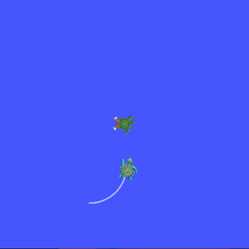

디버깅
==============

**목표:** 일반적인 tf2 관련 문제를 디버깅하는 체계적인 방법을 사용하는 방법을 배우세요.

배경 정보
----------

이 튜토리얼은 전형적인 tf2 문제를 디버깅하는 단계를 안내합니다.
또한 ``tf2_echo``, ``tf2_monitor``, ``view_frames`` 와 같은 다양한 tf2 디버깅 도구를 사용합니다.
이 튜토리얼은 :doc:`tf2 학습 <./0.index>` 튜토리얼을 완료한 것으로 가정합니다.

디버깅 예제
-----------------

1 예제 설정 및 시작
^^^^^^^^^^^^^^^^^^^^^^^^^^^^^^^^^^

이 튜토리얼에서는 여러 문제가 있는 데모 애플리케이션을 설정합니다.
이 튜토리얼의 목표는 이러한 문제를 찾고 해결하기 위해 체계적인 접근 방식을 적용하는 것입니다.
먼저 소스 파일을 만들어 보겠습니다.

:doc:`tf2 튜토리얼 <./0.index>` 에서 생성한 ``learning_tf2_cpp`` 패키지로 이동합니다.
``src`` 디렉토리에서 소스 파일 ``turtle_tf2_listener.cpp`` 의 사본을 만들고 ``turtle_tf2_listener_debug.cpp`` 로 이름을 바꿉니다.

선호하는 텍스트 편집기를 사용하여 파일을 열고, 67번째 줄을 다음과 같이 변경합니다.

.. code-block:: C++

   std::string toFrameRel = "turtle2";

에서

.. code-block:: C++

   std::string toFrameRel = "turtle3";

그리고 75-79번째 줄의 ``lookupTransform()`` 호출을 다음과 같이 변경합니다.

.. code-block:: C++

   try {
      transformStamped = tf_buffer_->lookupTransform(
        toFrameRel,
        fromFrameRel,
        tf2::TimePointZero);
   } catch (tf2::TransformException & ex) {

에서

.. code-block:: C++

   try {
      transformStamped = tf_buffer_->lookupTransform(
        toFrameRel,
        fromFrameRel,
        this->now());
   } catch (tf2::TransformException & ex) {

그리고 파일을 저장합니다.
이 데모를 실행하려면 ``learning_tf2_cpp`` 패키지의 ``launch`` 하위 디렉토리에 ``start_tf2_debug_demo.launch.py`` 라는 런치 파일을 만들어야 합니다.

.. code-block:: python

   from launch import LaunchDescription
   from launch.actions import DeclareLaunchArgument
   from launch.substitutions import LaunchConfiguration

   from launch_ros.actions import Node

   def generate_launch_description():
      return LaunchDescription([
         DeclareLaunchArgument(
            'target_frame', default_value='turtle1',
            description='Target frame name.'
         ),
         Node(
            package='turtlesim',
            executable='turtlesim_node',
            name='sim',
            output='screen'
         ),
         Node(
            package='learning_tf2_cpp',
            executable='turtle_tf2_broadcaster',
            name='broadcaster1',
            parameters=[
                  {'turtlename': 'turtle1'}
            ]
         ),
         Node(
            package='learning_tf2_cpp',
            executable='turtle_tf2_broadcaster',
            name='broadcaster2',
            parameters=[
                  {'turtlename': 'turtle2'}
            ]
         ),
         Node(
            package='learning_tf2_cpp',
            executable='turtle_tf2_listener_debug',
            name='listener_debug',
            parameters=[
                  {'target_frame': LaunchConfiguration('target_frame')}
            ]
         ),
      ])

또한 ``turtle_tf2_listener_debug`` 실행 파일을 ``CMakeLists.txt`` 에 추가하고 패키지를 빌드해야 합니다.

이제 실행하여 결과를 확인해 보겠습니다.

.. code-block:: console

   ros2 launch learning_tf2_cpp start_tf2_debug_demo.launch.py

이제 turtlesim이 실행됩니다.
동시에 다른 터미널 창에서 ``turtle_teleop_key`` 를 실행하면 화살표 키를 사용하여 ``turtle1`` 을 제어할 수 있습니다.

.. code-block:: console

   ros2 run turtlesim turtle_teleop_key

또한 왼쪽 하단에 두 번째 거북이가 있는 것을 알 수 있습니다.
데모가 올바르게 작동하면 두 번째 거북이는 화살표 키로 제어할 수 있는 거북이를 따라야 합니다.
그러나 현재 그렇지 않습니다. 몇 가지 문제를 해결해야 합니다.
다음과 같은 메시지를 확인해야 합니다.

.. code-block:: console

   [turtle_tf2_listener_debug-4] [INFO] [1630223454.942322623] [listener_debug]: Could not
   transform turtle3 to turtle1: "turtle3" passed to lookupTransform argument target_frame
   does not exist

2 tf2 요청 찾기
^^^^^^^^^^^^^^^^^^^^^^^^^

우선 정확히 어떤 것을 tf2에게 요청하는지 알아야 합니다.
따라서 tf2를 사용하는 코드 부분으로 이동합니다.
``src/turtle_tf2_listener_debug.cpp`` 파일을 열고 67번째 줄을 확인합니다.

.. code-block:: C++

   std::string to_frame_rel = "turtle3";

그리고 75-79번째 줄을 확인합니다.

.. code-block:: C++

   try {
      transformStamped = tf_buffer_->lookupTransform(
        toFrameRel,
        fromFrameRel,
        this->now());
   } catch (tf2::TransformException & ex) {

여기서 tf2에게 실제 요청을 보내는 것입니다.
세 가지 인수는 우리가 tf2에게 무엇을 요청하고 있는지 직접 알려줍니다. 프레임 ``turtle3`` 에서 프레임 ``turtle1`` 로 시간 ``now`` 의 변환을 요청하고 있습니다.

이제 이 요청이 실패하는 이유를 살펴보겠습니다.

3 프레임 확인
^^^^^^^^^^^^^^^^^^^^^

먼저 tf2가 ``turtle3`` 와 ``turtle1`` 간의 변환을 인식하는지 확인하려면 ``tf2_echo`` 도구를 사용합니다.

.. code-block:: console

   ros2 run tf2_ros tf2_echo turtle3 turtle1

결과에서 frame ``turtle3`` 이 존재하지 않음을 알 수 있습니다.

.. code-block:: console

   [INFO] [1630223557.477636052] [tf2_echo]: Waiting for transform turtle3 ->  turtle1:
   Invalid frame ID "turtle3" passed to canTransform argument target_frame - frame does
   not exist

그럼 어떤 프레임이 존재할까요?
이를 시각적으로 확인하려면 ``view_frames`` 도구를 사용합니다.

.. code-block:: console

   ros2 run tf2_tools view_frames

생성된 ``frames.pdf`` 파일을 열어 다음 출력을 확인합니다.

.. image:: images/turtlesim_frames.png

따라서 문제가 바로 ``turtle3`` 프레임을 요청하고 있기 때문임을 알 수 있습니다.
이 버그를 수정하려면 67번째 줄에서 ``turtle3`` 을 ``turtle2`` 로 바꾸면 됩니다.

이제 실행을 중지하고 데모를 빌드한 다음 다시 실행합니다.

.. code-block:: console

   ros2 launch turtle_tf2 start_debug_demo.launch.py

그런 다음 다음 문제에 직면합니다.

.. code-block:: console

   [turtle_tf2_listener_debug-4] [INFO] [1630223704.617382464] [listener_debug]: Could not
   transform turtle2 to turtle1: Lookup would require extrapolation into the future. Requested
   time 1630223704.617054 but the latest data is at time 1630223704.616726, when looking up
   transform from frame [turtle1] to frame [turtle2]

4 타임스탬프 확인
^^^^^^^^^^^^^^^^^^^^^^^^

이제 프레임 이름 문제를 해결했으므로 타임스탬프를 살펴봅니다.
기억하세요. 우리는 현재 시간(즉, ``now``)에 대한 ``turtle2`` 와 ``turtle1`` 간의 변환을 얻으려고 시도하고 있습니다.
타이밍에 대한 통계를 얻으려면 해당 프레임으로 ``tf2_monitor`` 를 호출하십시오.

.. code-block:: console

   ros2 run tf2_ros tf2_monitor turtle2 turtle1

결과는 다음과 같아야 합니다.

.. code-block:: console

   RESULTS: for turtle2 to turtle1
   Chain is: turtle1
   Net delay     avg = 0.00287347: max = 0.0167241

   Frames:
   Frame: turtle1, published by <no authority available>, Average Delay: 0.000295833, Max Delay: 0.000755072

   All Broadcasters:
   Node: <no authority available> 125.246 Hz, Average Delay: 0.000290237 Max Delay: 0.000786781

여기서 중요한 부분은 ``turtle2`` 에서 ``turtle1`` 로의 체인의 지연입니다.
결과에서 평균적으로 약 3 밀리초의 지연이 있는 것으로 나타납니다.
이것은 tf2가 3 밀리초 후에만 변환을 수행할 수 있음을 의미합니다.
따라서 ``now`` 대신에 변환을 하는 3 밀리초 전의 타임스탬프를 사용하면 가끔 답을 얻을 수 있습니다.
이를 빠르게 테스트하려면 75-79번째 줄을 다음과 같이 변경하십시오.

.. code-block:: C++

   try {
      transformStamped = tf_buffer_->lookupTransform(
        toFrameRel,
        fromFrameRel,
        this->now() - rclcpp::Duration::from_seconds(0.1));
   } catch (tf2::TransformException & ex) {

새 코드에서는 거북이 사이의 변환을 100 밀리초 전으로 요청하고 있습니다.
일반적으로 변환이 도착할 것이 확실하도록 더 긴 기간을 사용하는 것이 좋습니다.
데모를 중지하고 빌드한 다음 실행합니다.

.. code-block:: console

   ros2 launch turtle_tf2 start_debug_demo.launch.py

이제 거북이가 움직이는 것을 볼 수 있습니다!

마지막으로 우리가 한 마지막 수정은 실제로 원하는 것이 아니므로 참고용으로만 사용해야 합니다. 문제가 무엇인지 확인하기 위한 것이었습니다.
실제 수정은 다음과 같아야 합니다.

.. code-block:: C++

   try {
      transformStamped = tf_buffer_->lookupTransform(
        toFrameRel,
        fromFrameRel,
        tf2::TimePointZero);
   } catch (tf2::TransformException & ex) {

또는 다음과 같이 사용할 수 있습니다.

.. code-block:: C++

   try {
      transformStamped = tf_buffer_->lookupTransform(
        toFrameRel,
        fromFrameRel,
        tf2::TimePoint());
   } catch (tf2::TransformException & ex) {

타임아웃에 대한 자세한 내용은 :doc:`시간 사용 <./11.learning_about_tf2_and_time_cpp>` 튜토리얼에서 확인하고 다음과 같이 사용할 수 있습니다.

.. code-block:: C++

   try {
      transformStamped = tf_buffer_->lookupTransform(
        toFrameRel,
        fromFrameRel,
        this->now(),
        rclcpp::Duration::from_seconds(0.05));
   } catch (tf2::TransformException & ex) {

요약
--------------

이 튜토리얼에서는 tf2 관련 문제를 디버깅하기 위한 체계적인 접근 방법을 사용하는 방법을 배웠습니다.
또한 tf2 디버깅 도구인 ``tf2_echo``, ``tf2_monitor``, ``view_frames`` 등을 사용하여 tf2 문제를 디버깅하는 데 도움이 되는 방법을 배웠습니다.
