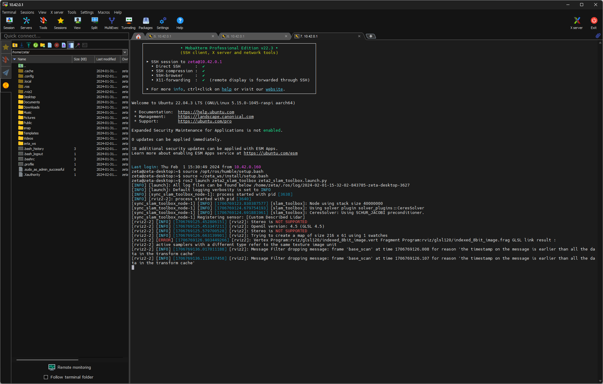
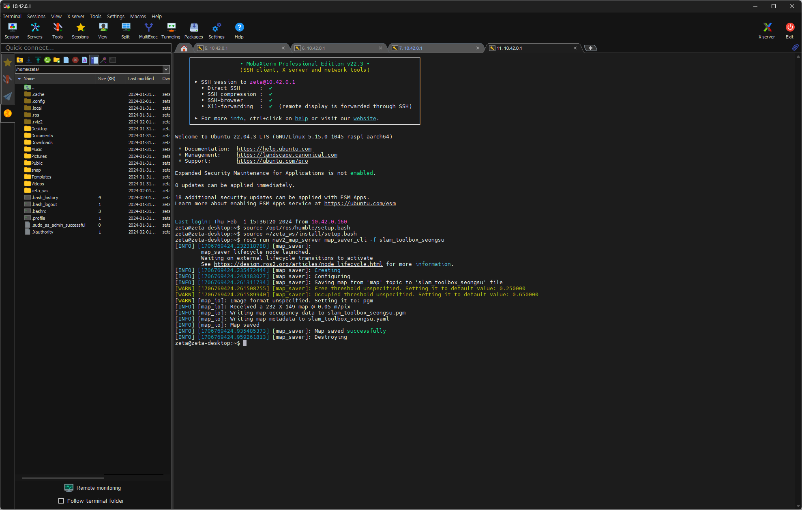

zeta2 autonomous
=================

**목표:** 로봇이 자율주행 할 수 있게 한다.

이 과정에서는 로봇을 사용하여 ``mapping`` 하고 ``navigation`` 하는 것 까지 해보겠습니다.

``mapping`` 의 방법으론 ``slam_tool_box`` 패키지와 ``cartographer`` 패키지 두개를 사용해서 해보도록 하겠습니다.

이 과정은 우분투 PC 에서 진행을 해야합니다. 패키지 또한 로봇에 설치하는 것이 아닌 PC에서 새로 만들 것입니다.

앞서 WiFi Setting을 했기 때문에 우리는 문제 없이 로봇과 연결 할 수 있습니다.

전제조건
--------

:doc:`zeta2_bringup <./1.zeta2_bringup>` 을 먼저 완료해야 합니다.

1 필요한 패키지들 설치
^^^^^^^^^^^^^^^^^^^^^^^^^^^^^^^

``slam_tool_box`` 패키지와 ``cartographer``, ``navigation`` 관련 패키지는 아래의 명령어로 설치할 수 있습니다.

.. code-block:: bash

   sudo apt update

   # slam_toolbox
   sudo apt install ros-humble-slam-toolbox -y

   # cartographer
   sudo apt install ros-humble-cartographer -y
   sudo apt install ros-humble-cartographer-ros -y

   # navigation
   sudo apt install ros-humble-xacro -y
   sudo apt install ros-humble-navigation2 -y
   sudo apt install ros-humble-nav2-bringup -y

다음으론 zeta2_autonomous 패키지를 설치하겠습니다.

.. note::
    
    **소스 해주기 전**
    
    과거 과정에서 소스 자동화를 하지 않았다면 여기서 해주는게 편합니다.

    PC의 터미널을 열고

    .. code-block:: bash

        echo "source /opt/ros/humble/setup.bash" >> ~/.bashrc

        source ~/.bashrc

    이 명령어를 입력합니다.

    한 번만 입력해 두면 다음부터 새로운 터미널을 열 때 마다 자동으로 소스가 진행 됩니다.

.. code-block:: bash
   
   source /opt/ros/humble/setup.bash // 위의 note 과정을 진행했으면 생략 가능

   mkdir -p ~/zeta_ws/src

   cd ~/zeta_ws/src
   git clone https://github.com/zetabank-devteam/zeta2_edu_autonomous.git

.. code-block:: bash

   cd ~/zeta_ws
   colcon build --packages-select zeta2_navigation zeta2_slam_toolbox zeta2_cartographer
   source ~/zeta_ws/install/setup.bash

.. note::
    
    **방금 만든 워크스페이스 소스 하는 법**
    
    우리가 만든 워크스페이스에서도 자동으로 소스를 할 수 있게 만들 수 있습니다.

    PC의 터미널을 열고

    .. code-block:: bash

        echo "source  ~/zeta_ws/install/setup.bash" >> ~/.bashrc
        
        source ~/.bashrc

    이 명령어를 입력합니다.

    한 번만 입력해 두면 다음부터 새로운 터미널을 열 때 마다 자동으로 소스가 진행 됩니다.

이제 필요한 패키지들은 설치가 완료 되었습니다. 

2 slam tool box 매핑
^^^^^^^^^^^^^^^^^^^^^^^

먼저 로봇에 접속해 ``zeta2_bringup`` 을 실행합니다.

.. image:: images/1_common.png

.. code-block:: bash

   ssh zeta@{ROBOT_IP}

   ros2 launch zeta2_bringup zeta2_bringup.launch.py # if, mc, control, odom, making tf, scan, joy

새로운 터미널을 열고 이번엔 로봇에 접속하지 않고 zeta_slam_toolbox를 실행한다. (``zeta_ws`` 를 계속 source 해줘야 합니다.)

.. code-block:: bash
   
   source ~/zeta_ws/install/setup.bash

   ros2 launch zeta2_slam_toolbox zeta2_slam_toolbox.launch.py

.. image:: images/4_toolbox.png

조이스틱으로 조작하며 맵을 확장해나간다.

.. image:: images/5_toolbox.png

rviz 화면을 보고 지도를 다 그리면 지도를 저장한다. 'Map saved successfully'가 나오면 성공

.. code-block:: bash

   ## ros2 run nav2_map_server map_saver_cli -f {원하는 지도 이름}
   ## 예시
   
   ros2 run nav2_map_server map_saver_cli -f slam_toolbox_seongsu

.. note::

   실패가 나오더라도 당황하지 않고 다시 실행하면 저장 된다.

   .. code-block:: bash
   
      # 1차 시도
      
      ros2 run nav2_map_server map_saver_cli -f office

      [INFO] [1707357911.897409677] [map_saver]:
            map_saver lifecycle node launched.
            Waiting on external lifecycle transitions to activate
            See https://design.ros2.org/articles/node_lifecycle.html for more information.
      [INFO] [1707357911.897945562] [map_saver]: Creating
      [INFO] [1707357911.898317319] [map_saver]: Configuring
      [INFO] [1707357911.912723324] [map_saver]: Saving map from 'map' topic to 'office' file
      [WARN] [1707357911.913061451] [map_saver]: Free threshold unspecified. Setting it to default value: 0.250000
      [WARN] [1707357911.913144432] [map_saver]: Occupied threshold unspecified. Setting it to default value: 0.650000
      [ERROR] [1707357913.919701158] [map_saver]: Failed to spin map subscription
      [INFO] [1707357913.925887446] [map_saver]: Destroying
      [ros2run]: Process exited with failure 1

      # 2차 시도

      ros2 run nav2_map_server map_saver_cli -f office

      [INFO] [1707357917.178735050] [map_saver]:
            map_saver lifecycle node launched.
            Waiting on external lifecycle transitions to activate
            See https://design.ros2.org/articles/node_lifecycle.html for more information.
      [INFO] [1707357917.180127725] [map_saver]: Creating
      [INFO] [1707357917.181631380] [map_saver]: Configuring
      [INFO] [1707357917.192101730] [map_saver]: Saving map from 'map' topic to 'office' file
      [WARN] [1707357917.192336839] [map_saver]: Free threshold unspecified. Setting it to default value: 0.250000
      [WARN] [1707357917.192414894] [map_saver]: Occupied threshold unspecified. Setting it to default value: 0.650000
      [WARN] [map_io]: Image format unspecified. Setting it to: pgm
      [INFO] [map_io]: Received a 245 X 162 map @ 0.05 m/pix
      [INFO] [map_io]: Writing map occupancy data to office.pgm
      [INFO] [map_io]: Writing map metadata to office.yaml
      [INFO] [map_io]: Map saved
      [INFO] [1707357917.726928492] [map_saver]: Map saved successfully
      [INFO] [1707357917.732879393] [map_saver]: Destroying

3 cartographer 매핑
^^^^^^^^^^^^^^^^^^^^^^^

먼저 로봇에 접속해 ``zeta2_bringup`` 을 실행합니다.

.. image:: images/1_common.png

.. code-block:: bash

   ssh zeta@{ROBOT_IP}

   ros2 launch zeta2_bringup zeta2_bringup.launch.py # if, mc, control, odom, making tf, scan, joy

새로운 터미널을 열고 이번엔 로봇에 접속하지 않고 zeta_cartographer를 실행한다.

.. code-block:: bash

   ros2 launch zeta2_cartographer zeta2_cartographer.launch.py

.. image:: images/3_carto.png

.. image:: images/4_carto.png

조이스틱으로 조작하며 맵을 확장해나간다.

rviz 화면을 보고 지도를 다 그리면 지도를 저장한다. 'Map saved successfully'가 나오면 성공

.. code-block:: bash

   ## ros2 run nav2_map_server map_saver_cli -f {원하는 지도 이름}
   ## 예시
   ros2 run nav2_map_server map_saver_cli -f carto_seongsu

4 navigation2 실행
^^^^^^^^^^^^^^^^^^

이 부분은 이제 로봇을 자율주행 하는 부분 입니다. 이 로봇은 ``DWBLocalPlanner`` 를 사용하여 주행합니다.

앞의 ``slam_toolbox`` 나 ``cartographer`` 과정을 완료 했으면 지도를 만들 수 있었을 것입니다.

그 지도를 사용하여 자율주행을 해볼 것 입니다.

.. note::

   **2.1 로봇 별 설정**

   로봇의 크기에 따라서 설정할 것들이 생깁니다.

   .. image:: images/robots_image.jpg

   왼쪽의 작은 로봇이 있고, 오른쪽의 조금 더 큰 로봇이 있습니다.

   지금 이 패키지는 조금 더 큰 로봇을 기준으로 완성 된 것입니다.

   그렇기에 작은 로봇을 사용할 경우엔 수정사항이 생깁니다.

   큰 로봇일 경우엔 스킵해도 됩니다.

   **2.1.1 zeta_dwb.yaml 수정**

   자율주행을 할 때 이 ``zeta_dwb.yaml`` 파일을 읽어서 파라미터들을 불러옵니다.

   이 값들 중에서 ``robot_radius`` 라는 값들이 있는데 이는 로봇의 반지름을 나타냅니다.

   실제 로봇의 모양은 원형이 아니지만 원이라 가정하고 로봇의 반경을 설정해 주는 부분입니다.

   좀 더 구체적인 형태로 나타내고 싶을 땐 ``footprint`` 를 사용할 수 있습니다.

   하지만 모양이 구체적일 수록 계산량이 늘어나서 지금 이 환경에선 추천하지 않습니다.

   자세한 정보는  `costmap <https://navigation.ros.org/configuration/packages/configuring-costmaps.html>`__ 을 참고 하시기 바랍니다.

   작은 로봇의 경우는 가장 끝에서 끝의 경우에 약 28cm 정도이기 때문에 ``0.16 -> 0.14`` 로 수정해 주시면 됩니다.

   .. code-block:: bash

      cd ~/zeta_ws/src/zeta2_edu_autonomous/zeta2_navigation/params

      gedit zeta_dwb.yaml

      -------
      .
      .
      .
      # 약 185번째 줄
      robot_radius: 0.16 -> robot_radius: 0.14
      .
      .
      .
      # 약 211번째 줄
      robot_radius: 0.16 -> robot_radius: 0.14
      -------

   이 두 부분을 수정해 주시면 됩니다.

   기존의 큰 로봇을 사용할 경우엔 생략하셔도 됩니다.

만들었던 맵을 zeta2_navigation/maps 폴더에 잘 넣는다. (맵은 ``pgm`` 파일과 ``yaml`` 파일 두개 다 필요하다.)

넣을 땐 구분하기 좋게 폴더 명을 만들어서 넣는게 좋다.

.. code-block:: bash

   zeta@zeta-desktop:~$ ls
   Desktop    Downloads  office.pgm   Pictures  snap       Videos
   Documents  Music      office.yaml  Public    Templates  zeta_ws

지금 경우엔 office라는 맵을 만들었었다.

.. code-block:: bash

   cd ~/zeta_ws/src/zeta2_edu_autonomous/zeta2_navigation/maps/
   mkdir office

   cd ~

   cp office* ~/zeta_ws/src/zeta2_edu_autonomous/zeta2_navigation/maps/office

이런 명령어를 통해 복사 할 수 있다.

맵을 다 넣었다면 zeta2_navigation 패키지의 launch 파일을 수정해줘야 한다. 지금은 기본으로 설정된 맵으로 지정 되어 있을 것이다.

.. code-block:: bash

   cd ~/zeta_ws/src/zeta2_edu_autonomous/zeta2_navigation/launch

   gedit zeta2_navigation.launch.py

   # 중간 쯤에 이렇게 되어 있는 곳이 있을 것이다. office 자리엔 본인이 생성한 폴더 이름 office.yaml 자리엔 본인의 yaml 파일 이름을 넣으면 된다.
   ----------
       map_dir = LaunchConfiguration(
        'map',
        default=os.path.join(
            zeta2_nav2_dir,
            'maps',
            'office',
            'office.yaml'))
   ----------

.. code-block:: bash
   
   cd ~/zeta_ws
   colcon build --packages-select zeta2_navigation

``zeta2_navigation`` 을 실행 할 땐 로봇의 ``zeta2_bringup`` 이 실행 되고 있어야 한다.

로봇에 ssh 접속하고 bringup 실행

.. code-block:: bash

   ssh zeta@{ROBOT_IP}

   source ~/zeta_ws/install/setup.bash
   ros2 launch zeta2_bringup zeta2_bringup.launch.py

``zeta2_navigation`` 패키지의 ``zeta2_navigation`` 런치 파일을 실행한다.

.. code-block:: bash

   source ~/zeta_ws/install/setup.bash
   ros2 launch zeta2_navigation zeta2_navigation.launch.py

.. image:: images/8_nav.png

로봇의 초기 위치를 세팅한다. 2D Pose Estimate를 클릭하고 초기 위치와 방향에 맞춰 드래그 한다.

.. image:: images/9_nav.png

2D Goas Pose를 클릭하고 원하는 위치 방향에 맞춰 드래그 하면 로봇이 움직인다.

.. image:: images/10_nav.png

요약
-------

``slam toolbox`` 와  ``cartographer`` 를 사용하여 매핑 하는 법을 배웠습니다.

``navigation2`` 를 사용하여 자율주행 하는 법을 배웠습니다.

구체적이고 자세한 설명은 각각의 패키지들에 대한 설명사이트를 참고하시길 바랍니다.(`slam_toolbox <https://github.com/SteveMacenski/slam_toolbox>`__, `cartographer <https://google-cartographer.readthedocs.io/en/latest/>`__, `navigation2 <https://navigation.ros.org/>`__)

다음 단계
----------

다음 과정에선 자율주행할 때 사용한 파라미터들에 대해서 알아보겠습니다.