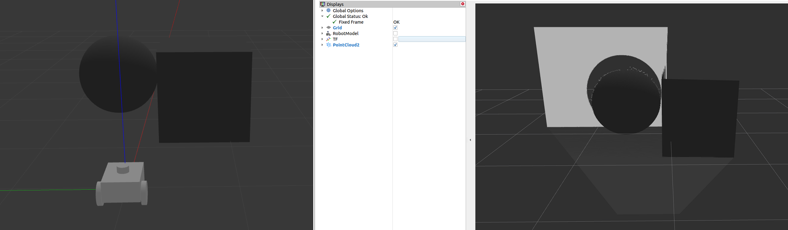
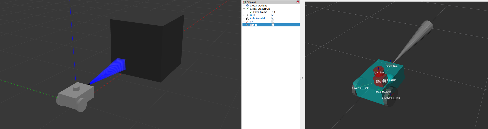

Navigation2 Start
===================

**목표:** ``navigation2`` 를 처음 사용할 때 가장 필수적인 요소들을 배워보고 zeta2 로봇에는 어떻게 사용되어 지는지 알아본다.

전제조건
--------

앞의 과정을 다 끝내고 와야 합니다. ROS2에 대한 기본 개념이 없으면 이해하기 힘들 수 있습니다.

우리는 기존에 ``zeta2_bringup`` 패키지의 ``zeta2_bringup.launch.py`` 파일을 실행하는 것으로 로봇이 기본적인 모든 구성 요소들을 불러올 수 있었습니다.

이 시간에는 ``navigation2`` 을 사용하기 위한 각각의 필수적 데이터들과 그 것들이 ``zeta2_bringup`` 안에 어떻게 들어가 있는지 알아보는 시간을 가지겠습니다.

1 ``navigation2`` 를 위한 로봇 셋업
^^^^^^^^^^^^^^^^^^^^^^^^^^^^^^^^^^^

``navigation2`` 를 사용하기 위해선 다양한 요소들이 있지만 간단한 요소들로도 충분히 사용할 수 있습니다.

가장 먼저 가장 중요한 ``TF`` 입니다. 이것은 ``Sensor`` 나 ``Odometry`` 같은 다양한 소스에서 들어오는 정보들을 좌표 프레임으로 사용하는 것입니다.

다음은 ``Odometry(오도메트리)`` 입니다. ``Odometry`` 는 일반적으로 휠인코더, IMU, Lidar, Radar 또는 Vio와 같은 센서 데이터를 사용하여 로봇의 자세와 속도를 추정하는 방법을 제공합니다.

다음은 ``Sensor(센서)`` 입니다. ``Sensor`` 는 로봇이 주변 환경을 인식하고 파악하기 위해 사용되는 장치로, lidar, radar, RGB 카메라, 깊이 카메라, IMU, GPS 등이 일반적으로 사용됩니다.

다음은 ``Footprint`` 입니다. ``Footprint`` 는 로봇의 2D 모양을 정의하여 Nav2의 경로 계획 알고리즘이 충돌을 피하도록 하는데 사용됩니다.

**하지만** 우리의 로봇은 base_link가 footprint를 대체할 수 있게 설정하였습니다.

마지막으로 ``Navigation plugins`` 입니다. 로봇의 경로 계획 및 제어를 위해 다양한 알고리즘을 사용할 수 있게 해주는 도구 입니다.

1.1 ``TF``
~~~~~~~~~~~~

``TF`` 는 이미 앞선 :doc:`TF2 </courses/4.intermediate_ros2/6.tf2/0.index>` 강의에서 배웠었습니다.

이 시간에는 자율주행에 필요한 가장 필수적인 ``TF`` 에 대해서 설명하겠습니다.

1. ``map`` => ``odom`` 사이의 ``TF`` 입니다. 

이 ``TF`` 는 로봇의 전역 위치를 나타내는 ``map`` 과 로봇의 상대적인 운동을 추적하는 ``odom`` 간의 관계를 정의합니다. 

``map`` 은 로봇이 움직이는 환경의 전역 지도를 나타내며, ``odom`` 은 로봇의 상대적인 이동을 추적합니다.

이 ``TF`` 를 통해 로봇의 운동학적 위치를 전역 지도에 매핑하여 로봇의 위치를 정확하게 추정할 수 있습니다.

또한 이 ``TF`` 는 ``SLAM(Simultaneous localization and Mapping)`` 알고리즘이나 ``AMCL(Adaptive Monte Carlo localization)`` 과 같은 로봇의 로컬라이제이션 시스템에 의해 생성됩니다.

자율주행을 사용하는 ``navigation2`` 에서는 ``AMCL`` 을 사용하여 생성해준다고 볼 수 있습니다.

2. ``odom`` => ``base_link`` 사이의 ``TF`` 입니다.

이 ``TF`` 는 로봇의 운동학적 위치를 나타내는 ``odom`` 과 로봇의 기준점인 ``base_link`` 간의 관계를 정의합니다.

``odom`` 은 로봇의 상대적인 이동을 추적하고 기록하는 데 사용됩니다.

이 ``TF`` 를 통해 로봇의 운동학적 위치를 로봇의 기준점으로 변환하여 제어 및 위치 추정에 사용할 수 있습니다.

zeta2 로봇의 경우엔 ``zeta2_edu_devel/zeta2_bringup/scripts/odometry.py`` 파일에서 ``odometry`` 도 생성하고 ``TF`` 도 생성합니다.

이 때 생성할 때의 코드를 보면 ``TransformBroadcaster`` 을 사용하여 생성한다는 것을 확인할 수 있습니다.

3. ``base_link`` => ``base_laser`` 사이의 ``TF`` 입니다.

이 ``TF`` 는 로봇의 기본적인 구조를 설명합니다.

``base_link`` 는 로봇의 기준점으로, 보통 로봇의 중심에 해당합니다.

``base_laser`` 는 로봇에 장착된 레이저 센서의 위치를 나타냅니다.

이 ``TF`` 를 통해 레이저 센서의 측정 데이터를 로봇의 기준점으로 변환하여 사용할 수 있습니다.

이 ``TF`` 의 경우엔 로봇이 한 번 조립되면 로봇의 중심과 레이저 센서의 위치가 변경되지 않기 때문에 정적(static)으로 지정됩니다.

이 ``TF`` 는 로봇의 초기 설치시 정확한 위치를 기반으로 설정되며, 로봇의 구성이 변경되지 않는 한 변하지 않습니다.

zeta2 로봇의 경우엔 ``zeta2_edu_devel/zeta2_bringup/launch/zeta2_state_publisher.launch.py`` 파일에서 ``TF`` 를 생성합니다.

이렇게 3가지 정도의 구성이 필수적인 요소들이라고 볼 수 있습니다.

``URDF`` 라는 것을 사용하면 좀 더 다양한 ``TF`` 구성요소를 쉽게 생성할 수 있습니다. 하지만 이 로봇의 경우엔 자원을 최대한 적게 사용하기 위해 가장 필수적인 요소들로만 구성을 했습니다.

``URDF`` 로 구성하는 것을 따로 학습 해보고 싶다면 `Setting Up The URDF <https://navigation.ros.org/setup_guides/urdf/setup_urdf.html>`__ 을 참고하시길 바랍니다.

이 과정에선 zeta2 로봇을 기준으로 작성했기 때문에 내용은 생략되었습니다.

1.2 ``Odometry(odom)``
~~~~~~~~~~~~~~~~~~~~~~

우리의 로봇에서는 역시나 ``zeta2_bringup.launch.py`` 를 사용하면 알아서 ``odometry`` 를 생성해 주었습니다.

이번 시간엔 이 결과가 어떻게 나오게 되었는지 간단하게 알아보겠습니다.

일단 먼저, ``Odometry(odom)`` 는 로봇의 운동학적인 위치와 자세를 추정하는 데 사용되는 정보입니다. 이 정보는 보통 선속도와 각속도를 기반으로 계산되며, 로봇의 이동과 회전을 추적하여 ``현재 위치와 자세`` 를 파악합니다.

예를 들어, ``선속도`` 와 ``각속도`` 를 이용하여 로봇의 ``이동 거리`` 와 ``회전 각도`` 를 계산할 수 있습니다. 이렇게 계산된 ``이동 거리`` 와 ``회전 각도`` 를 이전 위치와 자세에 누적함으로써 ``현재의 위치와 자세`` 를 추정할 수 있습니다. 이러한 작업은 로봇이 이동하는 동안 계속해서 이루어지며, 오도메트리 정보는 로봇의 위치 추정뿐만 아니라 제어 및 경로 계획에도 사용됩니다.

ROS에서는 오도메트리 정보는 주로 ``odom`` 이라는 토픽을 통해 게시됩니다. 이 정보는 보통 로봇의 현재 위치와 자세를 나타내는 ``Pose`` 와 ``Twist`` 메시지로 표현됩니다. ``Pose 메시지`` 는 로봇의 위치와 자세를 나타내고, ``Twist 메시지`` 는 로봇의 선속도와 각속도를 나타냅니다.

따라서 오도메트리는 로봇의 운동을 추적하고 제어하는 데 중요한 역할을 합니다. 오도메트리 정보를 정확하게 추정함으로써 로봇은 **자신의 위치를 파악** 하고 목표 지점으로 이동할 수 있습니다.

1.2.1 zeta2 로봇에서의 ``odom``
~~~~~~~~~~~~~~~~~~~~~~~~~~~~

zeta2 로봇에서 ``odometry`` 를 생성하는 파일의 위치는 ``zeta2_edu_devel/zeta2_bringup/scripts/odometry.py`` 입니다. 내용을 살펴보겠습니다.

``Odometry`` 를 업데이트하기 위해서 ``모터 보드`` 와 ``인터페이스 보드`` 에서 나오는 데이터를 활용합니다. ``모터 보드`` 에서는 ``선속도(v)`` 와 ``각속도(w)`` 를, 인터페이스 보드에서는 ``IMU`` 데이터를 받습니다.
이 두 가지 데이터를 조합하여 로봇의 위치와 자세를 추정하고 제어합니다.

1. 모터 보드 데이터 해석:
    - ``모터 보드`` 에서 받은 데이터를 해석하여 ``선속도(v)`` 와 ``각속도(w)`` 를 추출합니다.
    - ``선속도`` 는 로봇의 직진 또는 후진 속도를 나타내며, ``각속도`` 는 로봇의 회전 속도를 나타냅니다.
    - 이러한 데이터를 기반으로 로봇의 운동을 계산합니다.

2. IMU 데이터 활용:
    - ``인터페이스 보드`` 에서 받은 ``IMU`` 데이터를 사용하여 로봇의 자세를 보정합니다.
    - ``IMU`` 데이터는 로봇의 방향을 나타내는 각도 정보를 제공합니다. 이를 활용하여 로봇의 이동 방향에 대한 보정을 수행합니다.

3. 오도메트리 업데이트:
    - ``선속도`` 와 ``각속도`` 를 이용하여 로봇의 ``이동량`` 을 계산합니다.
    - ``이동량`` 과 ``IMU`` 에서 얻은 ``회전값`` 을 조합하여 ``로봇의 위치와 자세`` 를 업데이트합니다.
    - 최종적으로 계산된 위치와 자세 정보를 이용하여 ``오도메트리`` 를 업데이트합니다.

이렇게 모터 보드와 인터페이스 보드에서 받은 데이터를 조합하여 로봇의 운동을 추정하고 ``오도메트리`` 를 업데이트합니다.

이러한 과정을 통해 로봇은 자신의 위치와 자세를 추정하고, 외부로 이 정보를 전달하여 제어될 수 있습니다.

1.3 ``Sensor``
~~~~~~~~~~~~~~~

현재 이 로봇의 센서는 ``Lidar`` 만 사용하고 있습니다. 하지만 그 외의 다양한 센서들도 있습니다.

이번 시간엔 센서들에 대해서 설명을 해보겠습니다.

일반적인 센서 메시지
~~~~~~~~~~~~~~~~~~~~

nav2를 설정할 때 일반적인 ``sensor_msgs`` 들이 있습니다. 각각에 대해서 간단한 설명을 알려드리겠습니다.

1. ``sensor_msgs/LaserScan``

이 메시지는 평면 레이저 거리 측정기에서의 단일 스캔을 나타냅니다. 이 메시지는 localization 및 mapping을 위해 ``slam_toolbox`` 및 ``nav2_amcl`` 에서 사용되거나, perception을 위해 ``nav2_costmap_2d`` 에서 사용됩니다.

.. image:: images/sensor_laserscan.png

2. ``sensor_msgs/PointCloud2``

이 메시지는 3D 점의 집합을 보유하며, 각 점에 대한 선택적인 추가 정보를 포함합니다. 이는 3D 라이다, 2D 라이다, 깊이 카메라 등에서 올 수 있습니다.

3. ``sensor_msgs/Range``

이 메시지는 에너지를 방출하고 측정된 거리에서 하나의 범위 측정을 보고하는 활성 레인저에서의 단일 범위 읽기입니다. 초음파 센서, 적외선 센서 또는 1D 레인지 파인더가 이 메시지를 사용하는 예입니다.

4. ``sensor_msgs/Image``

이 메시지는 RGB 또는 깊이 카메라에서의 센서 읽기를 나타냅니다. RGB 또는 범위 값에 해당합니다.

매핑과 로컬라이제이션
~~~~~~~~~~~~~~~~~~~~~~

방금 전의 센서들을 가지고 맵을 생성하고 로봇을 맵에서 ``localization`` 할 수 있습니다. ``slam`` 할 때 사용했던 ``slam_toolbox`` 패키지 또한 ``localization`` 할 수 있는 도구 중 하나 입니다.

하지만 우린 ``nav2_amcl`` 을 사용해서 현재 위치를 구현했습니다. 이 것 또한 로봇의 위치와 방향을 맵 상에서 추정하는 패키지 입니다.

``slam_toolbox`` 와 ``nav2_amcl`` 모두 라이다 스캔 센서에서 정보를 사용하여 로봇 환경을 인식할 수 있습니다.

Costmap 2D Overview
~~~~~~~~~~~~~~~~~~~~

Costmap 2D는 로봇의 주변 환경을 효과적으로 표현하여 안전한 이동을 가능하게 하는 데 중요한 역할을 합니다.

주로 ``라이다(LiDAR)`` 센서로부터 수집된 데이터를 기반으로 작동하며, 다음과 같은 특징을 가집니다.

환경 표현:
    로봇의 주변 환경은 Costmap 2D를 통해 격자 형태의 그리드로 나타납니다. 각 격자 셀은 0에서 254 사이의 값으로 표현되며, 이는 해당 셀을 통과하는 데 필요한 비용을 의미합니다.
    셀의 값에 따라 무료(0), 치명적으로 점유(254)된 곳을 나타내며, 이를 통해 로봇은 안전한 경로를 계획하고 이동할 수 있습니다.

구성:
    Costmap 2D는 여러 레이어로 구성되어 있습니다. ``정적 레이어(static layer)``, ``장애물 레이어(obstacle layer)``, ``복셀 레이어(voxel layer)``, ``팽창 레이어(inflation layer)`` 등이 주로 사용됩니다.
    각 레이어는 플러그인 기반으로 작동하며, 사용자가 필요에 따라 쉽게 사용자 정의할 수 있습니다.

주요 레이어:
    - 정적 레이어: SLAM을 통해 생성된 지도 정보를 나타냅니다.
    - 장애물 레이어: 라이다나 포인트 클라우드와 같은 센서로 감지된 장애물을 표현합니다.
    - 복셀 레이어: 3D 데이터를 처리하며, 주로 3D 라이다 센서 정보를 활용합니다.
    - 팽창 레이어: 로봇의 형태를 고려하여 장애물 주변에 추가 비용을 부여하여 충돌을 피합니다.

이렇게 Costmap 2D를 설정하고 구성함으로써 로봇은 주변 환경을 인식하고 안전하게 이동할 수 있습니다.

1.4 ``Footprint``
~~~~~~~~~~~~~~~~~~~

``Footprint`` 는 로봇의 2D 모양을 바닥으로 투영한 것으로, Nav2에서 경로를 계산하거나 계획하는 동안 충돌을 피하기 위해 주로 사용됩니다.

이 작업에 참여하는 알고리즘은 로봇이 코스트맵의 장애물과 충돌하지 않도록 보장합니다.

우리의 로봇에선 ``footprint`` 자리에 ``base_link`` 로 사용을 하고 있습니다. 로봇이 낮아서 유사하게 사용해도 상관 없다고 생각했기 때문입니다.

반경은 로봇의 반지름으로 설정을 하여서 ``0.16`` 이 나왔고 작은 로봇은 또 다른 값으로 사용할 수 있습니다.

``footprint`` 는 ``local_costmap`` 과 ``global_costmap`` 둘 다 사용 되는데 일반적으로 ``global_costmap`` 에서는 원형, ``local_costmap`` 에서는 다각형이 사용됩니다.

하지만 우리 로봇은 둘 다 원형을 사용했습니다. 가장 큰 이유는 계산을 줄이고자 함이고, 다른 이유는 형태도 원형과 유사하기 때문입니다.

``Footprint`` 는 Nav2의 경로 탐색 알고리즘에 중요한 역할을 합니다.

1.5 ``Navigation Plugins``
~~~~~~~~~~~~~~~~~~~~~~~~~~~

이제 마지막 네비게이션의 플러그인 입니다. 로봇은 다양한 플래너와 컨트롤러 알고리즘을 사용하여 네비게이션 작업을 수행합니다.

로봇의 유형 및 환경에 따라 사용할 수 있는 알고리즘 플러그인에 대해 설명합니다.

우리의 로봇에도 다양한 플러그인이 사용된걸 확인할 수 있습니다.

``zeta2_edu_autonomous/zeta2_navigation/params`` 폴더의 파일들을 각각 열어보면 다양한 플러그인들이 사용되는걸 볼 수 있습니다.

플래너와 컨트롤러 서버
~~~~~~~~~~~~~~~~~~~~~~~

내비게이션 알고리즘은 ROS 액션 서버에서 실행되는 플러그인을 통해 Nav2에 구현됩니다.

이 부분에서는 내비게이션 스택의 핵심인 플래너 및 컨트롤러 서버에 대해 설명합니다.

이러한 서버는 각각 특정 액션 또는 로봇 상태에 대해 맞춤 설정된 복수의 알고리즘 플러그인을 구현할 수 있습니다.

이 가이드에서는 로봇 유형 및 환경에 따라 다른 알고리즘을 강조할 것입니다.

``플래너 서버`` 는 로봇의 경로를 계산하는 알고리즘을 구현하는 것이다.
예를 들어, 하나의 플러그인은 두 근접한 위치 간의 간단한 최단 경로를 계산하고, 다른 플러그인은 로봇 환경을 포괄하는 위치로의 경로를 계산할 수 있습니다.

``컨트롤러 서버`` 는 로봇이 지역 환경에서 작업을 완료하는 데 필요한 적절한 제어 노력을 생성합니다.
이러한 작업에는 플래너 서버에서 생성된 경로를 따라가는 것, 이 경로에 따라 동적 장애물을 피하는 것, 그리고 도킹 스테이션에서 충전하는 것 등이 포함될 수 있습니다.

다음 내용에서 이 내용은 좀 더 자세히 다뤄볼 것이다.

요약
-------

``navigation2`` 를 사용하기 위한 기본적인 구성요소들을 배웠습니다. 

이러한 구성 요소들이 정확히 설정되고 데이터가 올바르게 처리되어야 자율 주행이 원활하게 이루어질 수 있습니다.

더 자세한 설정 및 디버깅이 필요할 수 있지만, 이러한 기본적인 요소들을 이해하고 설정하는 것은 중요합니다.

다음 단계
----------

다음 과정에선 사용할 수 있는 플래너에 대해서 알아보겠습니다.