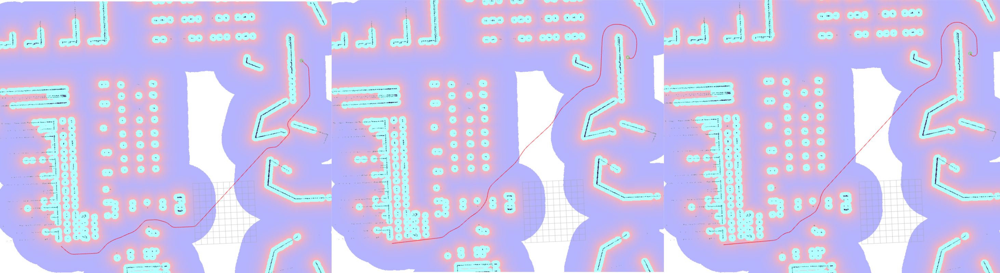

Smac 플래너
=============

``zeta2_navigation_smac_2d.launch.py`` 를 실행하면 체험해 볼 수 있습니다.

Github_ 에서 소스 코드 및 설계, 설명 및 메트릭을 포함한 ``README`` 를 확인할 수 있습니다. 아래에 간단한 설명이 있지만, ``README`` 에는 프레임워크 및 플래너 구현에 대한 가장 자세한 개요가 포함되어 있습니다.

.. _Github: https://github.com/ros-planning/navigation2/tree/main/nav2_smac_planner

Smac 플래너 플러그인은 세 가지 A* 기반의 계획 알고리즘을 구현합니다: 2D A*, Hybrid-A*, State Lattice 경로 계획자입니다.
2021년 6월과 2021년 12월에 패키지가 크게 업데이트되어 경로 품질과 실행 시간이 2~3배 향상되었습니다.

제공되는 플러그인
****************
아래 목록은 ``nav2_smac_planner`` 패키지 내에 있습니다. 개별 구성 정보는 개별 페이지를 참조하십시오.

.. toctree::
  :maxdepth: 1

  smac/configuring-smac-2d.rst
  smac/configuring-smac-hybrid.rst
  smac/configuring-smac-lattice.rst

설명
***********

``nav2_smac_planner`` 패키지에는 여러 유형의 로봇 플랫폼에 대한 여러 A* 기반 계획자를 생성하는 데 사용되는 최적화된 템플릿 A* 검색 알고리즘이 포함되어 있습니다. 

``SmacPlanner2D`` 플래너를 사용하여 원형 미끄럼 방지 및 원형 전방향 드라이브 로봇을 지원하며 비용 유의 A* 플래너를 구현합니다. 
``SmacPlannerHybrid`` 플러그인을 사용하여 차량류(아커만) 및 다리형 차량을 지원하며 Hybrid-A* 플래너를 구현합니다.
``SmacPlannerLattice`` 플러그인을 사용하여 원형이 아닌 임의의 모양, 어떤 모델의 차량을 지원하며 State Lattice 플래너를 구현합니다(예: omni, diff, ackermann, legged, custom).
이는 아커만, 다리형, 미끄럼 방지 및 전방향 차량에 대한 제어 세트 및 생성기를 포함하지만 다른 로봇 유형이나 다양한 계획 동작을 위해 자신의 것을 제공할 수 있습니다.

마지막 두 플러그인 모두 **운동학적으로 타당** 하며 **후진 지원** 을 지원합니다. 최적화된 휴리스틱 함수와 효율적인 프로그래밍을 통해 2D-A* 및 NavFn과 유사한 성능을 갖습니다. 3 개의 계획자의 예는 아래에 나와 있습니다. 대략적으로 75m의 경로를 계획했습니다.

- Hybrid-A*는 144ms에 경로를 계산했습니다.
- State Lattice는 113ms에 경로를 계산했습니다.
- 2D A*는 243ms에 경로를 계산했습니다.
- 참고로: NavFn은 146ms에 경로를 계산했으며, 몇 가지 난해한 경로 불연속성 아티팩트를 포함합니다.

보통의 계획 시간은 일부 환경에서 100ms 이하로, 가끔은 200ms까지 접근합니다. 3 개의 플래너의 성능은 오랫동안 ROS 네비게이션 생태계의 주요 구성 요소이던 간단한 2D 검색 알고리즘과 대략적으로 비슷하지만, 운동학적 타당성, 후진 지원 및 현대 최신 기술을 사용하여 비슷합니다.

    2D A* (패널 1), Hybrid-A* (패널 2), State Lattice (패널 3)

다음 단계
----------

다음 과정에선 ``Theta Star planner`` 에 대해서 알아보겠습니다.