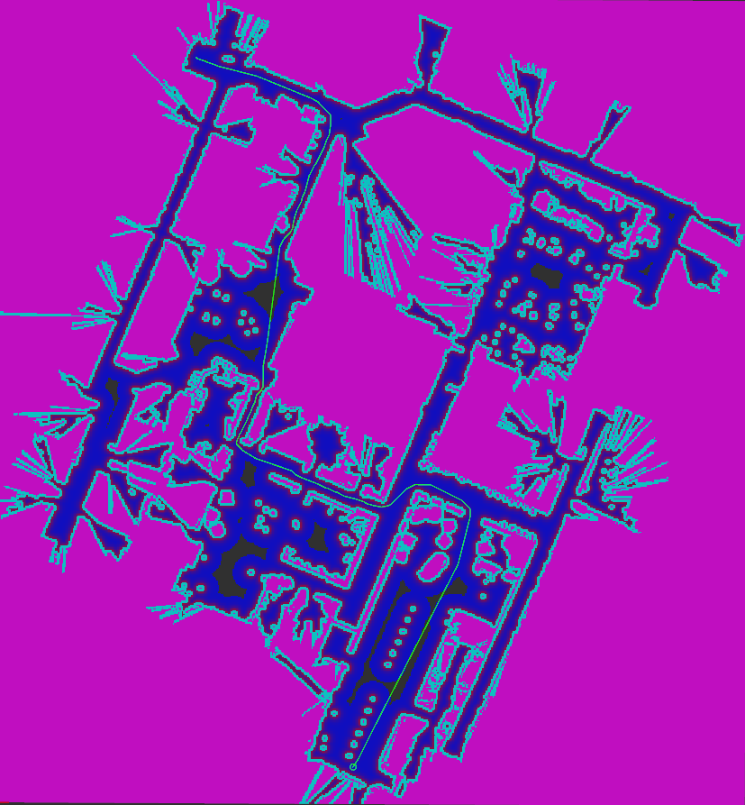

Theta Star Planner 설정
==========================

``zeta2_navigation_theta.launch.py`` 를 실행하면 체험해 볼 수 있습니다.

Theta Star Planner는 A*를 사용하여 어떤 각도의 선분에 초점을 맞춘 경로를 계획하는 Theta* 경로 계획기를 구현합니다.

아래 예제에서는 계획기가 약 46ms(평균 값)의 시간이 걸렸고 길이가 87.5m인 경로를 계산했습니다.

``<name>`` 은 이 유형에 선택된 해당 계획기 플러그인 ID입니다.

매개변수
##########

계획기의 매개변수는 다음과 같습니다:

:``<name>``.how_many_corners: 

  ============== =======
  타입           기본값
  -------------- -------
  int            8  
  ============== =======

  설명
    4-연결(위, 아래, 왼쪽, 오른쪽) 및 8-연결(모든 인접한 셀) 그래프 확장 사이에서 선택합니다. 허용되는 값은 4와 8입니다.

:``<name>`` .w_euc_cost: 

  ============== =======
  타입           기본값
  -------------- -------
  double         1.0  
  ============== =======

  설명
  	경로의 길이에 적용되는 가중치입니다. 

:``<name>``.w_traversal_cost: 
  
  ============== =======
  타입           기본값
  -------------- -------
  double         2.0 
  ============== =======

  설명
    고비용 노드가 얼마나 엄격하게 처벌되는지를 조정합니다. 위의 g(neigh) 방정식에서 볼 수 있듯이, 비용 관련 구성 요소는 코스트 함수의 이차 곡선을 형성하므로 이 매개변수를 증가시키면 곡선이 더 가팔라져서 그래프가 가팔라지면(비용이 높아질수록) 노드들 간의 차이(그래프가 가팔라질 때 비용의 차이가 증가합니다.)가 커집니다.

:``<name>``.use_final_approach_orientation:

  ====== =======
  타입   기본값                                                   
  ------ -------
  bool   false      
  ====== =======

  설명
    참이면, 계획기가 생성한 경로의 마지막 포즈의 방향이 접근 방향으로 설정됩니다. 즉, 경로의 마지막 두 점을 연결하는 벡터의 방향입니다.

:``<name>``.allow_unknown:

  ==== =======
  타입 기본값                                                   
  ---- -------
  bool True            
  ==== =======

  설명
    알려지지 않은 공간에서의 계획을 허용할지 여부입니다.

.. note::
  이 저장소 링크의 README 파일을 확인하여 이 계획기를 조정하는 방법에 대해 더 잘 이해하십시오.
  이 계획기를 사용하려면 코스트맵의 `cost_scaling_factor` 매개변수도 조정하여 좋은 결과를 얻을 수 있습니다.

Example
*******

.. code-block:: yaml
  
  planner_server:
    ros__parameters:
      expected_planner_frequency: 20.0
      use_sim_time: True
      planner_plugins: ["GridBased"]
      GridBased:
        plugin: "nav2_theta_star_planner/ThetaStarPlanner"
        how_many_corners: 8
        w_euc_cost: 1.0
        w_traversal_cost: 2.0
        w_heuristic_cost: 1.0

다음 단계
----------

다음 과정에선 다양한 ``컨트롤러`` 에 대해서 알아보겠습니다.