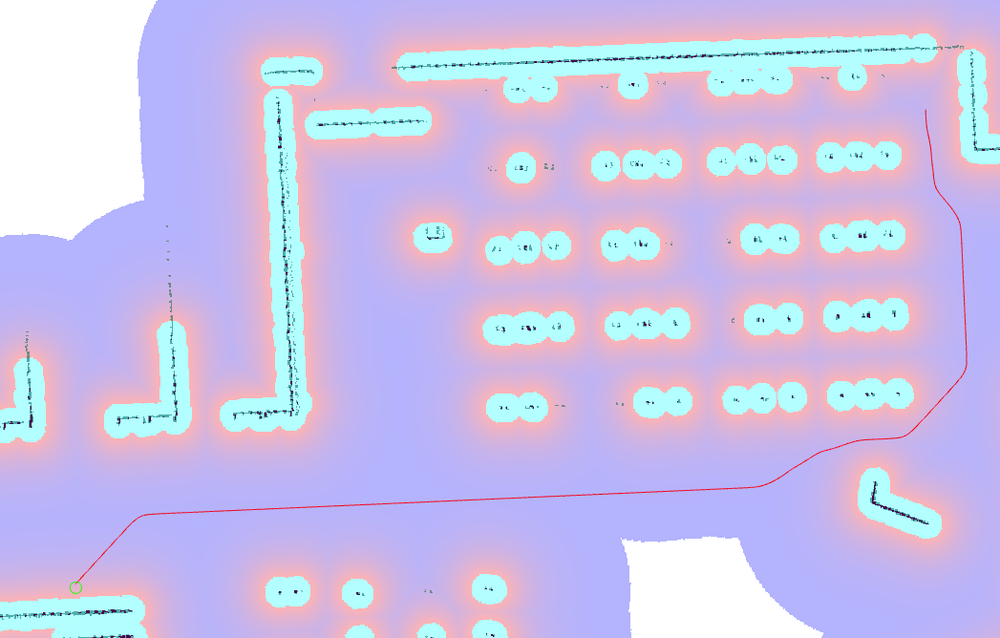

Smac 2D 플래너
===============

이 플래너는 Smac Planner 프레임워크 내에서 비용 유의 휴리스틱 A* 알고리즘을 구현하며 Hybrid-A* 및 State Lattice 플래너와 동일한 코드 및 동작을 공유합니다.

``<name>`` 은 이 유형에 대해 선택된 해당 플래너 플러그인 ID입니다.

매개 변수
**********

:``<name>``.tolerance:

  ============== =======
  유형           기본값
  -------------- -------
  double         0.125  
  ============== =======

  설명
    요청된 목표 포즈와 경로의 끝 사이의 허용 오차(미터 단위).

:``<name>``.downsample_costmap:

  ==== =======
  유형   기본값                                                   
  ---- -------
  bool  False            
  ==== =======

  설명
    검색을 위해 다른 해상도로 costmap을 다운 샘플링할지 여부.

:``<name>``.downsampling_factor:

  ==== =======
  유형   기본값                                                   
  ---- -------
  int   1            
  ==== =======

  설명
    Costmap을 다운 샘플링하는 데 사용할 배수(factor) (예: 5cm costmap에 2로 ``downsample_factor`` 를 설정하면 10cm 출력).

:``<name>``.allow_unknown:

  ==== =======
  유형   기본값                                                   
  ---- -------
  bool  True            
  ==== =======

  설명
    알려지지 않은 공간에서 이동/검색을 허용할지 여부.

:``<name>``.max_iterations:

  ==== =======
  유형   기본값                                                   
  ---- -------
  int   1000000            
  ==== =======

  설명
    계산 시간을 제한하기 위해 실패하기 전에 최대 검색 반복 횟수, -1로 비활성화됨.

:``<name>``.max_on_approach_iterations:

  ==== =======
  유형   기본값                                                   
  ---- -------
  int   1000            
  ==== =======

  설명
    정확한 경로를 찾을 수 없는 경우, 경로가 ``tolerance`` 내에 있을 때 검색 이후 최대 반복 횟수.

:``<name>``.max_planning_time:

  ====== =======
  유형    기본값                                                   
  ------ -------
  double  2.0            
  ====== =======

  설명
    최대 계획 시간(초 단위).

:``<name>``.cost_travel_multiplier:

  ====== =======
  유형    기본값                                                   
  ------ -------
  double 2.0            
  ====== =======

  설명
    고비용 지역을 피하기 위해 검색에 적용할 비용 배수. 더 큰 값은 통로의 중앙에 정확하게 배치되지만(무료 `FREE` 비용 잠재 필드가 존재하는 경우), 약간 더 오래 걸립니다. 속도를 최적화하기 위해 1.0의 값을 사용하는 것이 합리적입니다. 합리적인 트레이드오프 값은 2.0입니다. 값이 0.0이면 장애물을 피하는 스티어링이 비활성화되고, 바이너리 서치 A*처럼 작동합니다.

:``<name>``.use_final_approach_orientation:

  ====== =======
  유형    기본값                                                   
  ------ -------
  bool   false      
  ====== =======

  설명
    참이면, 플래너에서 생성된 경로의 마지막 포즈의 방향이 접근 방향(즉, 경로의 마지막 두 지점을 연결하는 벡터의 방향)으로 설정됩니다.

:``<name>``.smoother.max_iterations:

  ====== =======
  유형    기본값                                                   
  ------ -------
  int    1000         
  ====== =======

  설명
    경로를 스무딩하는 데 스무더가 가질 수 있는 최대 반복 횟수, 잠재적인 계산을 제한합니다.

:``<name>``.smoother.w_smooth:

  ====== =======
  유형    기본값                                                   
  ------ -------
  double 0.3         
  ====== =======

  설명
    데이터 포인트를 스무딩하는 데 적용할 스무딩 가중치

:``<name>``.smoother.w_data:

  ====== =======
  유형    기본값                                                   
  ------ -------
  double 0.2         
  ====== =======

  설명
    원래 데이터 정보를 유지하는 데 스무딩에 적용할 가중치

:``<name>``.smoother.tolerance:

  ====== =======
  유형    기본값                                                   
  ------ -------
  double 1e-10       
  ====== =======

  설명
    스무딩 세션을 종료할 허용 오차 변화 양

Example
*******
.. code-block:: yaml

  planner_server:
    ros__parameters:
      planner_plugins: ["GridBased"]
      use_sim_time: True

      GridBased:
        plugin: "nav2_smac_planner/SmacPlanner2D"
        tolerance: 0.125                      # tolerance for planning if unable to reach exact pose, in meters
        downsample_costmap: false             # whether or not to downsample the map
        downsampling_factor: 1                # multiplier for the resolution of the costmap layer (e.g. 2 on a 5cm costmap would be 10cm)
        allow_unknown: true                   # allow traveling in unknown space
        max_iterations: 1000000               # maximum total iterations to search for before failing (in case unreachable), set to -1 to disable
        max_on_approach_iterations: 1000      # maximum number of iterations to attempt to reach goal once in tolerance
        max_planning_time: 2.0                # max time in s for planner to plan, smooth
        cost_travel_multiplier: 2.0           # Cost multiplier to apply to search to steer away from high cost areas. Larger values will place in the center of aisles more exactly (if non-`FREE` cost potential field exists) but take slightly longer to compute. To optimize for speed, a value of 1.0 is reasonable. A reasonable tradeoff value is 2.0. A value of 0.0 effective disables steering away from obstacles and acts like a naive binary search A*.
        use_final_approach_orientation: false # Whether to set the final path pose at the goal's orientation to the requested orientation (false) or in line with the approach angle so the robot doesn't rotate to heading (true)
        smoother:
          max_iterations: 1000
          w_smooth: 0.3
          w_data: 0.2
          tolerance: 1.0e-10
