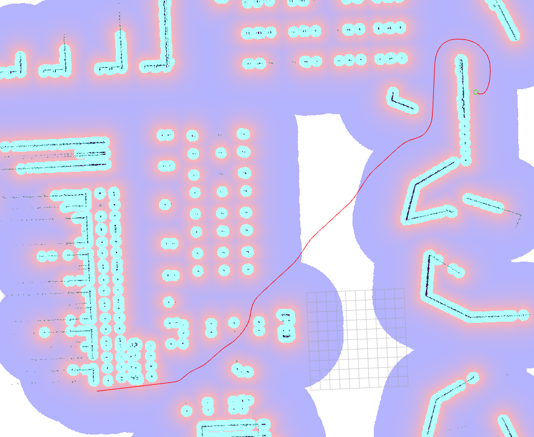

Smac Hybrid-A* Planner
=========================

이 플러그인은 사용자의 코스트맵 셀을 떠날 수 있는 최소한의 모션 프리미티브로 비례적으로 크기가 조정된 비용에 민감한 하이브리드 A* 전역 경로 계획기를 구현합니다.

``<name>`` 은 이 유형에 대해 선택된 해당 플래너 플러그인 ID입니다.

매개변수
**********

:``<name>``.downsample_costmap:

  ==== =======
  타입  기본값                                                   
  ---- -------
  bool False            
  ==== =======

  설명
    검색을 위해 코스트맵을 다른 해상도로 다운샘플할지 여부입니다.

:``<name>``.downsampling_factor:

  ==== =======
  타입  기본값                                                   
  ---- -------
  int  1            
  ==== =======

  설명
    코스트맵을 다운샘플할 배율 인자입니다. (예: 5cm 코스트맵이 2배의 ``downsample_factor`` 로 10cm 출력).

:``<name>``.allow_unknown:

  ==== =======
  타입  기본값                                                   
  ---- -------
  bool True            
  ==== =======

  설명
    알 수 없는 공간을 통과/검색할지 여부입니다.
    
:``<name>``.tolerance:

  ====== =======
  타입    기본값                                                   
  ------ -------
  double 0.25            
  ====== =======

  설명
    정확한 경로를 찾을 수 없을 때 요청된 포즈에서 벗어날 수 있는 용인 가능한 허용 오차입니다.

:``<name>``.max_iterations:

  ==== =======
  타입  기본값                                                   
  ---- -------
  int  1000000            
  ==== =======

  설명
    최대 계산 시간을 제한하기 전에 검색 반복 횟수입니다. -1로 비활성화됩니다.

:``<name>``.max_on_approach_iterations:

  ==== =======
  타입  기본값                                                   
  ---- -------
  int  1000            
  ==== =======

  설명
    방문한 노드가 목표 허용 오차 내에 있을 때 정확한 일치를 계속 찾기 위한 최대 반복 횟수입니다. 음수 값은 무한대로 변환됩니다.

:``<name>``.max_planning_time:

  ====== =======
  타입    기본값                                                   
  ------ -------
  double  5.0            
  ====== =======

  설명
    최대 계획 시간(초)입니다.

:``<name>``.analytic_expansion_ratio:

  ====== =======
  타입    기본값                                                   
  ------ -------
  double 3.5            
  ====== =======

  설명
    플래너는 이 값과 최소 휴리스틱을 비례적으로 고려하여 분석적 확장을 완료하려고 시도합니다.

:``<name>``.analytic_expansion_max_length:

  ====== =======
  타입    기본값                                                   
  ------ -------
  double 3.0            
  ====== =======

  설명
    길이가 너무 멀 경우 이 확장을 거부합니다. 이는 검색 중에 목표 지점에서 멀리 떨어진 곳에서의 검색에 대한 패널티 함수가 목표 자체로부터 반대 방향으로 중간에 반전하거나 고비용 영역을 절단하지 않도록 합니다. 이 값은 사용 중인 최소 회전 반경의 4-5배 이상이어야 하며, 그렇지 않으면 계획 시간이 급격히 증가합니다.

:``<name>``.analytic_expansion_max_cost:

  ====== =======
  타입    기본값                                                   
  ------ -------
  double 200.0        
  ====== =======

  설명
    하이브리드/레티스 노드의 경우: 분석적 확장의 어느 부분이든 단일 비용이 최대 비용을 포함하고 유효한 것으로 간주되는 최대 비용입니다(목표에 접근할 때 제외됩니다). 이는 원하는 곳보다 더 높은 비용 공간으로의 잠재적인 바이패스를 제거할 수 있게 합니다.

:``<name>``.analytic_expansion_max_cost_override:

  ====== =======
  타입    기본값                                                   
  ------ -------
  bool   false           
  ====== =======

  설명
    하이브리드/레티스 노드의 경우: 목표에 대한 중요한 거리 내에 있을 때 최대 비용 설정을 재정의할지 여부입니다(아마도 필요합니다). 확장이 목표에서 **2pi** 최소 반경 내에 있으면 `false` 일 때 최대 비용을 재정의합니다.

:``<name>``.motion_model_for_search:

  ====== =======
  타입    기본값                                                   
  ------ -------
  string "DUBIN"            
  ====== =======

  설명
    검색에 사용할 모션 모델 열거형 문자열입니다. Hybrid-A* 노드의 경우 기본값은 "DUBIN"입니다. SE2의 옵션은 DUBIN 또는 REEDS_SHEPP입니다.

:``<name>``.angle_quantization_bins:

  ==== =======
  타입  기본값                                                   
  ---- -------
  int  72            
  ==== =======

  설명
    SE2 검색에 사용할 각도 구간의 수입니다. 이는 짝수일 수 있지만, 좋은 기본값은 64 또는 72입니다(5도 간격).

:``<name>``.minimum_turning_radius:

  ====== =======
  타입    기본값                                                   
  ------ -------
  double 0.4          
  ====== =======

  설명
    차량의 최소 회전 반경(미터)입니다. 스무더에서 최대 곡률을 계산하는 데 사용됩니다.

:``<name>``.reverse_penalty:

  ====== =======
  타입    기본값                                                   
  ------ -------
  double 2.0          
  ====== =======

  설명
    검색 중에 역방향으로 이동하는 경우 SE2 노드에 적용할 휴리스틱 패널티입니다. REEDS_SHEPP 모션 모델에서만 사용됩니다.

:``<name>``.change_penalty:

  ====== =======
  타입    기본값                                                   
  ------ -------
  double 0.0          
  ====== =======

  설명
    검색 중에 방향을 변경할 때(예: 왼쪽에서 오른쪽) SE2 노드에 적용할 휴리스틱 패널티입니다. 하이브리드-A* 플래너의 적절성을 보장하고자 변경 후에는 기본적으로 비활성화됩니다.

:``<name>``.non_straight_penalty:

  ====== =======
  타입    기본값                                                   
  ------ -------
  double 1.20         
  ====== =======

  설명
    직진 방향으로 검색하는 경우 SE2 노드에 적용할 휴리스틱 패널티입니다.

:``<name>``.cost_penalty:

  ====== =======
  타입    기본값                                                   
  ------ -------
  double 2.0         
  ====== =======

  설명
    자세에서의 비용에 대한 SE2 노드에 적용할 휴리스틱 패널티입니다. Hybrid-A*가 비용을 인식할 수 있게 합니다.

:``<name>``.retrospective_penalty:

  ====== =======
  타입    기본값                                                   
  ------ -------
  double 0.015         
  ====== =======

  설명
    SE2 노드에 적용할 휴리스틱 패널티입니다. Hybrid-A*가 경로 상의 이른 결정을 선호하게 만들어 검색 시간을 절약합니다. 이전 (짧은) 가지가 필요할 때까지 더 이상 확장되지 않습니다. 완전하게 접근 가능하려면 `0.0` 이어야 합니다.

:``<name>``.lookup_table_size:

  ====== =======
  타입    기본값                                                   
  ------ -------
  double 20.0         
  ====== =======

  설명
    캐시할 dubin/reeds-sheep 거리 창의 크기(미터).

:``<name>``.debug_visualizations:

  ====== =======
  타입    기본값                                                   
  ------ -------
  bool   false         
  ====== =======

  설명
    ``/expansions`` 주제에 확장과 ``/planned_footprints`` 주제에 경로의 발자국을 배열로 게시할지 여부입니다. 경고: 계산과 표시가 무거우며 성능이 저하됩니다.

:``<name>``.cache_obstacle_heuristic:

  ====== =======
  타입    기본값                                                   
  ------ -------
  bool   false         
  ====== =======

  설명
    고정된 목표 위치의 다음 재계획 사이에 장애물 맵 동적 프로그래밍 거리 확장 휴리스틱을 캐시할지 여부입니다. 코스트맵이 대부분 정적인 경우 재계획 성능(40배)을 크게 향상시킵니다.

:``<name>``.allow_primitive_interpolation:

  ====== =======
  타입    기본값                                                   
  ------ -------
  bool   false         
  ====== =======

  설명
   고급 기능: 사용자는 정규 프리미티브 집합 사이의 각도 양자화 점프 사이에 추가적인 프리미티브를 탐색 세트에 추가하여 보간할 수 있습니다(예: 좌회전, 우회전, 직진).
   이렇게 하면 가장 좌측부터 가장 우측까지의 각도 구간마다 모든 프리미티브가 탐색을 위한 프리미티브 세트에 표시됩니다.
   따라서 설정(예: 0.4 회전 반경, 5cm 코스트맵, 72 bins)이 3 양자화로 이동하면 0,3,6,9,... 대신 전체 1,2,3,4,5,6,7,8,9,... 세트를 탐색할 수 있습니다.
   이는 일반적으로 계산 시간이 증가하지만, 기본 프리미티브 집합이 대표적이지 않을 때 "지그재그"와 같은 동작을 제거할 수 있습니다.
   좁은 휴리스틱 채널을 더 잘 따르기 위해 좁은 환경에서 사용될 때 계산 시간이 덜 소요될 수 있습니다.
   이를 활성화할 때는 `angle_quantization_bins` 을 다시 조정해야 합니다.
   이전 예제를 이어서, 활성화된 경우 `angle_quantization_bins` 를 24로 설정한 것과 동일하므로 시작할 때 32를 선택하는 것이 좋습니다.
   계산 시간에 상당한 변경 없이 더 높은 품질을 얻을 수 있습니다.

:``<name>``.downsample_obstacle_heuristic:

  ====== =======
  타입   기본값                                                   
  ------ -------
  부울   True         
  ====== =======

  설명
    고급 기능: 이 기능을 사용하면 사용자가 장애물 휴리스틱의 코스트맵 표현을 다운샘플링하여 코스트맵의 전체 해상도에서 탐색할 수 있습니다.
    이로 인해 초기 검색 시간이 증가하지만, 목표로 하는 2D 근사 경로를 검색하는 동안 검색 반복 횟수가 감소하고 약간 더 매끄러운 경로가 생성됩니다.
    `smooth_path` 가 켜져 있으면 증가한 매끄러움이 눈에 띌 정도는 아니지만, 모든 고급 기능을 결합하면 일부 계산 시간을 제외하고도 전체적으로 더 나은 계획에 기여할 수 있습니다.
    이는 맵 크기 및 요청된 경로 계획의 복잡성과 함께 확장됩니다. 더 간단한 맵 / 경로의 경우, 초기 검색 시간 및 반복 횟수가 낮아져 실제로 성능이 향상될 수 있습니다.

:``<name>``.use_quadratic_cost_penalty:

  ====== =======
  타입   기본값                                                   
  ------ -------
  부울   False         
  ====== =======

  설명
    고급 기능: 이 기능을 사용하면 사용자가 선형 대신 이차 적용법을 지정하여 탐색 및 휴리스틱 비용 계산을 수행할 수 있습니다(예: ``cost * cost``).
    이렇게 하면 탐색이 보다 깊은 최적 채널로 이동하고 검색 가지를 더 적극적으로 가지치기하여 계획 시간이 단축됩니다.
    이로 인해 전반적으로 훨씬 더 매끄러운 경로가 생성되지만, 탐색이 넓은 복도나 개방 공간의 중앙에 남아 있는 것을 완화하여 낮은 유한 비용을 줄이려고 시도하지 않으므로 장애물에 다소 가까워질 수 있습니다.
    일반적으로 이 기능을 사용할 때는 변경 및 직선 이외의 벌칙을 사용하지 않아도 됩니다. 이 매개변수를 사용하려면 비용 벌칙 및 팽창 레이어 매개변수를 조정하여 최적의 성능을 얻도록 해야 할 수 있습니다.

:``<name>``.smooth_path:

  ====== =======
  타입   기본값                                                   
  ------ -------
  부울   True      
  ====== =======

  설명
    만약 True라면, 탐색에서 경로에 대한 간단하고 빠른 스무딩 후처리를 수행합니다.

:``<name>``.smoother.max_iterations:

  ====== =======
  타입   기본값                                                   
  ------ -------
  정수    1000         
  ====== =======

  설명
    경로를 스무딩하기 위해 스무더가 수행할 수 있는 최대 반복 횟수, 계산을 제한하기 위해 설정됩니다.

:``<name>``.smoother.w_smooth:

  ====== =======
  타입   기본값                                                   
  ------ -------
  배율   0.3         
  ====== =======

  설명
    데이터 포인트를 매끄럽게 만들기 위해 스무더에 적용할 가중치

:``<name>``.smoother.w_data:

  ====== =======
  타입   기본값                                                   
  ------ -------
  배율   0.2         
  ====== =======

  설명
    원래 데이터 정보를 유지하기 위해 스무더에 적용할 가중치

:``<name>``.smoother.tolerance:

  ====== =======
  타입   기본값                                                   
  ------ -------
  배율   1e-10       
  ====== =======

  설명
    스무딩 세션을 종료하기 위한 매개변수 허용 오차 변경 양

:``<name>``.smoother.do_refinement:

  ====== =======
  타입   기본값                                                   
  ------ -------
  부울   True       
  ====== =======

  설명
    추가 정제 스무딩 실행을 수행합니다. 기본적으로 이는 마지막 스무딩 주기의 출력을 사용하여 경로를 더 매끄럽게 만들기 위해 스무더를 재귀적으로 호출합니다. 이는 매우 작은 프리미티브 길이로 인한 하이브리드 A* 플래너의 추가 "떨림" 때문에 품질이 향상되는 경향이 있지만, 일부 장애물에 약간 가까워질 수 있습니다.

:``<name>``.smoother.refinement_num:

  ============== ===========================
  타입           기본값                    
  -------------- ---------------------------
  정수            2   
  ============== ===========================

  설명
    스무딩을 재귀적으로 시도할 횟수입니다. 반드시 ``>= 1`` 이어야 합니다.

Example
*******
.. code-block:: yaml

  planner_server:
    ros__parameters:
      planner_plugins: ["GridBased"]
      use_sim_time: True

      GridBased:
        plugin: "nav2_smac_planner/SmacPlannerHybrid"
        downsample_costmap: false           # whether or not to downsample the map
        downsampling_factor: 1              # multiplier for the resolution of the costmap layer (e.g. 2 on a 5cm costmap would be 10cm)
        tolerance: 0.25                     # dist-to-goal heuristic cost (distance) for valid tolerance endpoints if exact goal cannot be found.
        allow_unknown: true                 # allow traveling in unknown space
        max_iterations: 1000000             # maximum total iterations to search for before failing (in case unreachable), set to -1 to disable
        max_on_approach_iterations: 1000    # Maximum number of iterations after within tolerances to continue to try to find exact solution
        max_planning_time: 5.0              # max time in s for planner to plan, smooth
        motion_model_for_search: "DUBIN"    # Hybrid-A* Dubin, Redds-Shepp
        angle_quantization_bins: 72         # Number of angle bins for search
        analytic_expansion_ratio: 3.5       # The ratio to attempt analytic expansions during search for final approach.
        analytic_expansion_max_length: 3.0  # For Hybrid/Lattice nodes: The maximum length of the analytic expansion to be considered valid to prevent unsafe shortcutting
        analytic_expansion_max_cost: 200.0  # The maximum single cost for any part of an analytic expansion to contain and be valid, except when necessary on approach to goal
        analytic_expansion_max_cost_override: false  #  Whether or not to override the maximum cost setting if within critical distance to goal (ie probably required)
        minimum_turning_radius: 0.40        # minimum turning radius in m of path / vehicle
        reverse_penalty: 2.0                # Penalty to apply if motion is reversing, must be => 1
        change_penalty: 0.0                 # Penalty to apply if motion is changing directions (L to R), must be >= 0
        non_straight_penalty: 1.2           # Penalty to apply if motion is non-straight, must be => 1
        cost_penalty: 2.0                   # Penalty to apply to higher cost areas when adding into the obstacle map dynamic programming distance expansion heuristic. This drives the robot more towards the center of passages. A value between 1.3 - 3.5 is reasonable.
        retrospective_penalty: 0.015
        lookup_table_size: 20.0             # Size of the dubin/reeds-sheep distance window to cache, in meters.
        cache_obstacle_heuristic: false     # Cache the obstacle map dynamic programming distance expansion heuristic between subsiquent replannings of the same goal location. Dramatically speeds up replanning performance (40x) if costmap is largely static.   
        debug_visualizations: false         # For Hybrid nodes: Whether to publish expansions on the /expansions topic as an array of poses (the orientation has no meaning) and the path's footprints on the /planned_footprints topic. WARNING: heavy to compute and to display, for debug only as it degrades the performance.
        use_quadratic_cost_penalty: False
        downsample_obstacle_heuristic: True
        allow_primitive_interpolation: False
        smooth_path: True                   # If true, does a simple and quick smoothing post-processing to the path

        smoother:
          max_iterations: 1000
          w_smooth: 0.3
          w_data: 0.2
          tolerance: 1.0e-10
          do_refinement: true
          refinement_num: 2
