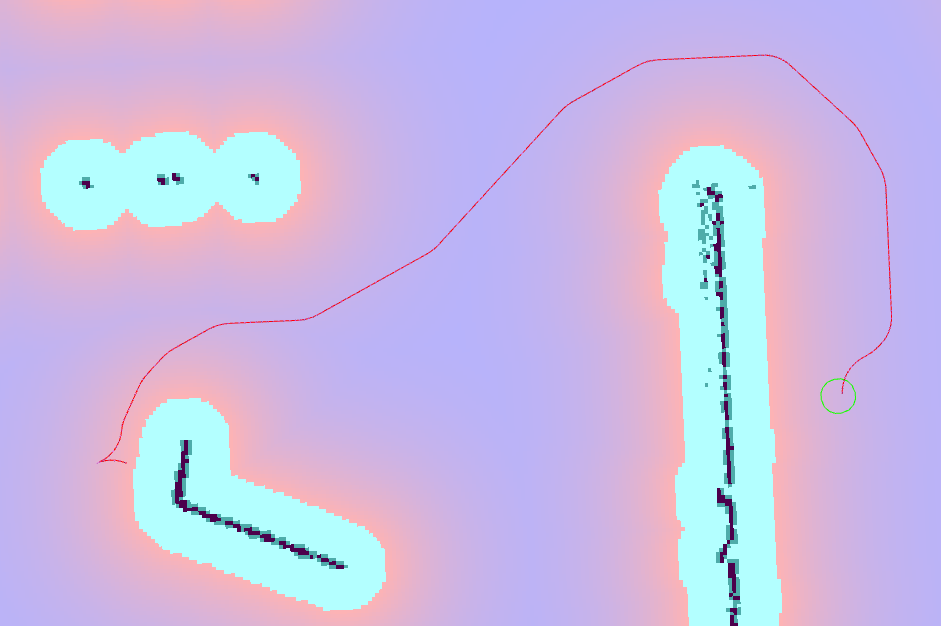

Smac State Lattice Planner
===========================

이 플래너는 미리 계산된 오프라인 최소 제어 세트를 사용하여 일반적인 상태 격자 전역 경로 계획기를 구현합니다. 패키지에는 최소 곡률 제약, 제자리 회전 및 전방향 이동을 기반으로 최소 제어 세트를 계산하는 파이썬 유틸리티도 포함되어 있습니다. 그러나 다른 최소 제어 세트를 사용할 수 있습니다. 단, 패키지의 README 파일에 지정된 파일 형식 사양을 따르는 경우에 한합니다.

``<name>`` 은 이 유형에 대해 선택된 플래너 플러그인 ID입니다.

참고: 상태 격자는 최소 제어 세트가 생성될 때 맵 해상도와 결합되기 때문에 코스트맵 다운샘플러가 없습니다. 또한 최소 회전 반지름은 상태 격자에 매개변수로 지정되지 않습니다. 이는 최소 제어 세트 사전 계산 단계에서 지정되었습니다. 자동차에 대한 사용자 지정 제어 세트를 생성하려면 Smac Planner 패키지를 참조하거나 사전 생성된 예제 중 하나를 사용하십시오.

위의 이미지에서는 로봇이 장애물에 가까운 좁은 요청된 위치로 후진할 수 있도록 역 확장이 활성화되어 있습니다.

매개변수
**********

:``<name>``.allow_unknown:

  ==== =======
  타입 기본값                                                   
  ---- -------
  부울 True            
  ==== =======

  설명
    알려지지 않은 공간을 통과/검색할지 여부입니다.

:``<name>``.tolerance:

  ====== =======
  타입   기본값                                                   
  ------ -------
  배율 0.25            
  ====== =======

  설명
    정확한 경로를 찾을 수 없는 경우 요청된 자세와 목표까지의 휴리스틱 비용 차이로 측정된 허용되는 허용 오차입니다.

:``<name>``.max_iterations:

  ==== =======
  타입 기본값                                                   
  ---- -------
  정수 1000000            
  ==== =======

  설명
    계산 시간을 제한하기 위해 실패하기 전에 최대 검색 반복 횟수, -1로 비활성화됩니다.
    
:``<name>``.max_on_approach_iterations:

  ==== =======
  타입 기본값                                                   
  ---- -------
  정수 1000            
  ==== =======

  설명
    방문한 노드가 목표 허용치 내에 있을 때 정확한 일치를 찾으려고 계속 시도할 최대 반복 횟수입니다. 그렇지 않으면 허용 오차 내에서 최상의 경로 솔루션을 반환합니다.

:``<name>``.max_planning_time:

  ====== =======
  타입   기본값                                                   
  ------ -------
  배율 5.0            
  ====== =======

  설명
    최대 계획 시간(초).

:``<name>``.analytic_expansion_ratio:

  ====== =======
  타입   기본값                                                   
  ------ -------
  배율 3.5            
  ====== =======

  설명
    SE2 노드가 최소 휴리스틱에 비례하여 이 값과 함께 분석적으로 확장을 완료하려고 시도할 때의 빈도입니다. 음수 값은 무한으로 변환됩니다.

:``<name>``.analytic_expansion_max_length:

  ====== =======
  타입   기본값                                                   
  ------ -------
  배율 3.0            
  ====== =======

  설명
    길이가 너무 멀 경우 이 확장을 거부합니다. 이렇게 하면 목표까지의 거리에서 매우 멀리 있는 검색의 바로 가기(예: 열린 맵의 중간에서 반대 방향으로 후진하지 않거나 고비용 영역을 통과하지 않도록)이 방지됩니다.
    이 값은 사용되는 최소 회전 반지름의 4-5배보다 작아서는 안 되며, 그렇지 않으면 계획 시간이 급격히 증가할 수 있습니다.

:``<name>``.analytic_expansion_max_cost:

  ====== =======
  타입   기본값                                                   
  ------ -------
  배율 200.0        
  ====== =======

  설명
    Hybrid/Lattice 노드의 경우: 분석적 확장의 일부에 대해 포함하고 유효하다고 간주되는 최대 단일 비용입니다(목표에 접근할 때 필요한 경우를 제외합니다). 이를 통해 원하지 않는 고비용 공간으로의 잠재적인 바로 가기를 제거할 수 있습니다.

:``<name>``.analytic_expansion_max_cost_override:

  ====== =======
  타입   기본값                                                   
  ------ -------
  부울   False           
  ====== =======

  설명
    Hybrid/Lattice 노드의 경우: 목표에 대한 중요 거리 내에서 최대 비용 설정을 무시할지 여부입니다(아마도 필요한 경우). 확장이 목표에 대한 2 * pi * min_r 내에 있는 경우 ``false`` 라면 최대 비용을 무시합니다.

:``<name>``.reverse_penalty:

  ====== =======
  타입   기본값                                                   
  ------ -------
  배율 2.0          
  ====== =======

  설명
    후진 방향으로 검색하는 경우 SE2 노드에 적용할 휴리스틱 패널티입니다. ``allow_reverse_expansion = true`` 에서만 사용됩니다.

:``<name>``.change_penalty:

  ====== =======
  타입   기본값                                                   
  ------ -------
  배율 0.05          
  ====== =======

  설명
    검색 중 방향을 변경할 때(예: 왼쪽에서 오른쪽으로) SE2 노드에 적용할 휴리스틱 패널티입니다.

:``<name>``.non_straight_penalty:

  ====== =======
  타입   기본값                                                   
  ------ -------
  배율 1.05         
  ====== =======

  설명
    비직진 방향으로 검색하는 경우 SE2 노드에 적용할 휴리스틱 패널티입니다.

:``<name>``.cost_penalty:

  ====== =======
  타입   기본값                                                   
  ------ -------
  배율 2.0         
  ====== =======

  설명
    자세에서의 비용에 SE2 노드에 적용할 휴리스틱 패널티입니다. 상태 격자를 코스트에 민감하게 만듭니다.

:``<name>``.rotation_penalty:

  ====== =======
  타입   기본값                                                   
  ------ -------
  배율 5.0         
  ====== =======

  설명
    제자리 회전을 포함하는 경우 제자리 회전에 대한 페널티입니다. 이는 제자리 회전이 장애물 회피에 엄격하게 필요하지 않은 경우에도 반드시 충분히 높게 설정되어야 합니다.
    그렇지 않으면 계획에 로봇이 제자리 회전하여 경로를 단축시키도록 요청하는 경우 계획에 빈번한 불연속성이 발생할 수 있습니다.

:``<name>``.retrospective_penalty:

  ====== =======
  타입   기본값                                                   
  ------ -------
  배율 0.015         
  ====== =======

  설명
    SE2 노드 패널티에 적용할 후방 휴리스틱 패널티입니다. 상태 격자가 경로에서 이른 시간에 이후의 조향 동작을 선호하도록 만듭니다.
    조기 (짧은) 분기는 필요할 때까지 확장되지 않기 때문에 검색 시간이 절약됩니다.
    ``0.0`` 이상 ``1.0`` 이하여야 합니다. ``0.0`` 이어야 완전히 성공적이어야 합니다.

:``<name>``.lattice_filepath:

  ====== =======
  타입   기본값                                                   
  ------ -------
  문자열 ""         
  ====== =======

  설명
    상태 격자 최소 제어 세트 그래프의 파일 경로입니다. 기본적으로 이는 기본 테스트 및 평가를 위해 ``test/`` 에 위치한 16 개 bin, 0.5m 회전 반지름 제어 세트로 설정됩니다(Hybrid-A*의 기본값은 0.5m입니다).

:``<name>``.lookup_table_size:

  ====== =======
  타입   기본값                                                   
  ------ -------
  배율 20.0         
  ====== =======

  설명
    캐시할 dubin/reeds-sheep 거리 창의 크기(미터 단위).

:``<name>``.cache_obstacle_heuristic:

  ====== =======
  타입   기본값                                                   
  ------ -------
  부울   False         
  ====== =======

  설명
    동일한 목표 위치의 연속적인 재계획 사이에 장애물 맵 동적 프로그래밍 거리 확장 휴리스틱을 캐시합니다. 코스트맵이 대부분 정적인 경우 다시 계획 성능을 크게 향상시킵니다(40배).

:``<name>``.allow_reverse_expansion:

  ====== =======
  타입   기본값                                                   
  ------ -------
  부울   False      
  ====== =======

  설명
    True이면 로봇이 현재 로봇 방향의 거울 반대 방향으로 확장하도록 허용합니다.

:``<name>``.debug_visualizations:

  ====== =======
  타입   기본값                                                   
  ------ -------
  부울   False         
  ====== =======

  설명
    ``/expansions`` 주제에 확장을 배열의 자세 및 경로 발자국으로 게시할지 여부 및 ``/planned_footprints`` 주제에 발자국을 게시할지 여부입니다.
    경고: 계산 및 표시에 많은 자원이 필요하므로 성능이 저하됩니다. 격자 확장은 밀집 경로 출력에서 볼 수 있는 중간 단계가 아닌 원시의 끝점을 보여줍니다.

:``<name>``.smooth_path:

  ====== =======
  타입   기본값                                                   
  ------ -------
  부울   True      
  ====== =======

  설명
    True이면 검색 경로에 대해 간단하고 빠른 스무딩 후 처리를 수행합니다.

:``<name>``.smoother.max_iterations:

  ====== =======
  타입   기본값                                                   
  ------ -------
  정수    1000         
  ====== =======

  설명
    스무딩이 경로를 스무딩하는 데 필요한 최대 반복 횟수를 제한합니다.

:``<name>``.smoother.w_smooth:

  ====== =======
  타입   기본값                                                   
  ------ -------
  배율 0.3         
  ====== =======

  설명
    데이터 포인트를 매끄럽게 하는 데 사용할 스무딩 가중치입니다.

:``<name>``.smoother.w_data:

  ====== =======
  타입   기본값                                                   
  ------ -------
  배율 0.2         
  ====== =======

  설명
    원래 데이터 정보를 유지하는 데 사용할 스무딩 가중치입니다.

:``<name>``.smoother.tolerance:

  ====== =======
  타입   기본값                                                   
  ------ -------
  배율 1e-10       
  ====== =======

  설명
    스무딩 세션을 종료할 허용되는 허용 변화 양입니다.

:``<name>``.smoother.do_refinement:

  ====== =======
  타입   기본값                                                   
  ------ -------
  부울   True       
  ====== =======

  설명
    추가 세부 경향을 부드럽게 만드는 추가 세부 스무딩 실행을 수행합니다. 이것은 일반적으로 하이브리드-A* 계획기에서 품질을 향상시키지만, 상태 격자 계획기에서는 제한된 헤딩 수로 인한 ``블록`` 움직임을 줄이기 위해 도움이 될 수 있습니다.

:``<name>``.smoother.refinement_num:

  ============== ===========================
  타입           기본값                    
  -------------- ---------------------------
  정수            2   
  ============== ===========================

  설명
    스무딩을 재귀적으로 시도할 횟수입니다. ``>= 1`` 이어야 합니다.

Example
*******
.. code-block:: yaml

  planner_server:
    ros__parameters:
      planner_plugins: ["GridBased"]
      use_sim_time: True

      GridBased:
        plugin: "nav2_smac_planner/SmacPlannerLattice"
        allow_unknown: true                 # Allow traveling in unknown space
        tolerance: 0.25                     # dist-to-goal heuristic cost (distance) for valid tolerance endpoints if exact goal cannot be found.
        max_iterations: 1000000             # Maximum total iterations to search for before failing (in case unreachable), set to -1 to disable
        max_on_approach_iterations: 1000    # Maximum number of iterations after within tolerances to continue to try to find exact solution
        max_planning_time: 5.0              # Max time in s for planner to plan, smooth
        analytic_expansion_ratio: 3.5       # The ratio to attempt analytic expansions during search for final approach.
        analytic_expansion_max_length: 3.0  # For Hybrid/Lattice nodes The maximum length of the analytic expansion to be considered valid to prevent unsafe shortcutting
        analytic_expansion_max_cost: 200.0  # The maximum single cost for any part of an analytic expansion to contain and be valid, except when necessary on approach to goal
        analytic_expansion_max_cost_override: false  #  Whether or not to override the maximum cost setting if within critical distance to goal (ie probably required)
        reverse_penalty: 2.0                # Penalty to apply if motion is reversing, must be => 1
        change_penalty: 0.05                # Penalty to apply if motion is changing directions (L to R), must be >= 0
        non_straight_penalty: 1.05          # Penalty to apply if motion is non-straight, must be => 1
        cost_penalty: 2.0                   # Penalty to apply to higher cost areas when adding into the obstacle map dynamic programming distance expansion heuristic. This drives the robot more towards the center of passages. A value between 1.3 - 3.5 is reasonable.
        rotation_penalty: 5.0               # Penalty to apply to in-place rotations, if minimum control set contains them
        retrospective_penalty: 0.015
        lattice_filepath: ""                # The filepath to the state lattice graph
        lookup_table_size: 20.0             # Size of the dubin/reeds-sheep distance window to cache, in meters.
        cache_obstacle_heuristic: false     # Cache the obstacle map dynamic programming distance expansion heuristic between subsiquent replannings of the same goal location. Dramatically speeds up replanning performance (40x) if costmap is largely static.
        allow_reverse_expansion: false      # If true, allows the robot to use the primitives to expand in the mirrored opposite direction of the current robot's orientation (to reverse).
        smooth_path: True                   # If true, does a simple and quick smoothing post-processing to the path
        smoother:
          max_iterations: 1000
          w_smooth: 0.3
          w_data: 0.2
          tolerance: 1.0e-10
          do_refinement: true
          refinement_num: 2
